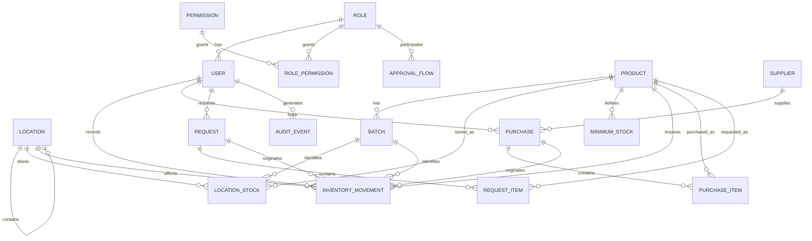

# Initial Project Plan — Inventory Control System

> Versión en español: `plan-inicial-proyecto-inventario.md` (the original; this is the translation).

## 1. Working methodology

**Context**: project built by **a single person**, dedicating **weekends / spare time** (not full-time). This makes classic Scrum with daily ceremonies and rigid 2-week sprints unrealistic, so it's adapted to **Scrumban**: the Scrum artifacts that give structure and visibility are kept (prioritized backlog, user stories, DoR/DoD, iterations with a personal demo/retro), but strict timeboxing and team-oriented ceremonies are dropped.

**Why not pure Kanban**: a scope goal per iteration is still needed (to test the MVP in pieces instead of leaving everything for the end), so iterations are kept — just longer and more flexible than a team sprint.

**Single role (development)**: you're both Product Owner and developer. There's no Scrum Master as such — its function (process discipline, not letting half-finished work pile up) becomes self-management supported by the Kanban board and the WIP limit.

**Additional role — Functional stakeholder / validator**: a person outside of development who gives **sign-off** on each delivery. With the roadmap split into several MVPs (section 3.1), their validation is no longer a single gate at the end of the project: **they review each MVP as it's delivered**, testing directly on the staging environment (self-service). This gives early feedback — if something doesn't meet the real business expectation, it's caught when MVP 1 closes (month 3-4), not when MVP 4 closes (month 8-9).

**Personal board** (Trello, GitHub Projects, or personal Jira): columns `Backlog` → `In progress` (WIP limit: 1-2 stories at a time, to avoid spreading too thin) → `In testing` → `Done`.

**Pace of work**:
- **Iteration**: 3-4 calendar weeks (equivalent to a "sprint", but sized to actual weekend availability, not consecutive workdays)
- **Personal review** at the close of each iteration: does the story meet its acceptance criteria? What needs fixing before moving on? (replaces the team Sprint Review/Retro)
- It's preferable to have **fewer, fully-tested stories per iteration** than many half-done ones — that's how your requirement of fixing errors before moving forward gets honored.

**Definition of Ready (DoR)** — a story is ready to work on if it has:
- Clear, verifiable acceptance criteria (remember: nobody else reviews them until the end)
- UI design (if applicable) or a minimal wireframe
- Technical dependencies identified

**Definition of Done (DoD)** — a story is done if:
- Code reviewed (self-review with a checklist, see section 5)
- Unit and/or BDD tests passing
- Deployed to the staging environment
- Self-validated against the acceptance criteria (the functional stakeholder's validation happens when the story's MVP closes, sections 3.1 and 6)

---

## 2. Requirements gathering

### 2.1 Functional requirements (summary by module)

| Module | Requirement |
|---|---|
| Suppliers | Supplier CRUD, contact details, associated purchase history |
| Locations | Location/room CRUD, inventory-to-location relationship |
| Inventory | Stock tracking per product+location, movements (in/out/transfer), optional batch/expiration support per product |
| Alerts | Notification when a product's stock at a location drops below a configured minimum |
| Purchases | Purchase order registration to a supplier (quantity, price, date), full history |
| Price comparison | Report of a given product's price across different suppliers over time |
| Requests | Purchase requests to suppliers and internal consumption requests, with an approval flow |
| Roles and permissions | Role-based access control to modules and specific actions |
| Authentication | Secure login, session, password recovery |

### 2.2 Non-functional requirements

- **Security**: see dedicated epic (section 3, Epic 8) and the OWASP Top 10 mitigation checklist (section 4.7). This is a cross-cutting requirement: every business story must go through input validation, backend access control, and safe error handling — not just the explicit security stories.
- **Scalability**: modular architecture that can grow from dozens to hundreds of users without a redesign
- **Traceability**: every inventory movement and every request approval must be recorded immutably (who, when, what)
- **Availability**: acceptable for small scale, deployed on the free tier initially
- **Usability**: clear interface for non-technical roles (e.g. warehouse staff)

---

## 3. User stories — initial prioritized backlog

> Format: *As a [role], I want [action], so that [benefit]*. Prioritized with MoSCoW (Must/Should/Could).

### Epic 1 — Authentication and roles
- **HU-01** (Must) As a user, I want to log in with a username and password, so that I can access the system securely.
  - Criterion: invalid credentials show an error; a successful login redirects based on role.
- **HU-02** (Must) As an administrator, I want to create roles and assign permissions by module/action, so that I can control what each user can do.
  - Criterion: a user without permission can't see or execute the restricted action (validated in the backend).
- **HU-03** (Must) As an administrator, I want to assign a role to each user, so that the system applies their permissions.

### Epic 2 — Suppliers
- **HU-04** (Must) As a buyer, I want to register a supplier with their contact details, so that I can associate purchases with them.
- **HU-05** (Must) As a buyer, I want to see a supplier's purchase history, so that I can evaluate their performance.

### Epic 3 — Locations
- **HU-06** (Must) As an inventory admin, I want to create locations/rooms, so that I can organize where inventory is stored.
- **HU-07** (Must) As an inventory admin, I want to associate products/stock with a specific location, so that I know what's where.

### Epic 4 — Catalog and inventory
- **HU-28** (Must) As an inventory admin, I want to create and edit catalog products (name, description, unit of measure, category), so that I can manage inventory, purchases, and requests for them.
  - *Validation note: this story was missing from the original backlog — every other inventory, purchase, and request story depends on the product existing first.*
  - *TT-23 note: unit of measure and category are picked from administrable catalogs (CATEGORY, UNIT — see section 7.2), not typed as free text. Requires the inventory admin to be able to add new catalog values before or while creating a product.*
- **HU-08** (Must) As an inventory admin, I want to record stock in and out by location, so that inventory stays up to date.
- **HU-09** (Must) As an inventory admin, I want to mark a product as "requires batch/expiration", so that perishable products are tracked differently from ones that aren't.
  - *Reclassified from Should to Must: you confirmed "it depends on the product" — that's a real business need, not an extra.*
- **HU-10** (Must) As any authorized user, I want to check current stock by product and location, so that I can make informed decisions.
- **HU-26** (Should) As an inventory admin, I want to attach an image to each product, so that I can identify it visually in the system.
  - Criterion: only jpg/png/webp formats are accepted, with a defined max size (e.g. 5MB); the file is stored in Cloudflare R2 (not on the app server) and served via URL, never referenced by a local path.

### Epic 5 — Alerts
- **HU-11** (Must) As an inventory admin, I want to define a minimum stock level per product/location, so that I get alerted before it runs out.
- **HU-12** (Must) As a system user, I want to see a panel of products in alert, so that I can act quickly.
  - *Reclassified from Should to Must: an alert with no way to see it doesn't fulfill the original "alerts for items running low" requirement.*

### Epic 6 — Purchases and price comparison
- **HU-13** (Must) As a buyer, I want to record a purchase from a supplier with quantities and prices, so that inventory and history get updated.
- **HU-14** (Must) As a buyer, I want to compare the price of the same product across different suppliers, so that I can decide who to buy from.
  - *Reclassified from Should to Must: price comparison was one of the explicit requirements from your very first message, not an extra.*

### Epic 7 — Requests
- **HU-15** (Must) As a requesting user, I want to create a purchase request to a supplier, so that I can ask for inventory restocking.
- **HU-16** (Must) As a requesting user, I want to create an internal consumption request, so that I can withdraw inventory from a location.
- **HU-17** (Must) As an approver, I want to approve or reject a request, so that I can control outflows and purchases.
  - Criterion: the approval flow must be configurable (a single approver today, multi-level in the future) without changing the data model.
- **HU-18** (Could) As an administrator, I want to configure approval levels by request type, so that the system can adapt to a future organizational structure.

### Epic 8 — Security (cross-cutting)
> This epic combines specific security stories with criteria that apply to **every** business story already listed (input validation and backend access control, not just frontend).

- **HU-19** (Must) As the system, I want to enforce a minimum password policy and store passwords hashed (never in plain text), so that unauthorized access is prevented if the database leaks.
- **HU-20** (Must) As the system, I want to limit and temporarily lock out repeated failed login attempts, so that brute-force attacks are prevented.
- **HU-21** (Must) As the system, I want to validate and sanitize all user input in the backend (not just the frontend), so that SQL injection, XSS, and malicious payloads are prevented.
  - Criterion: no query is built by string concatenation; everything goes through the ORM (parameterized queries) and validated DTOs.
- **HU-22** (Must) As the system, I want to enforce HTTPS and apply security HTTP headers (CSP, HSTS, X-Frame-Options, etc.), so that common network and browser attacks are mitigated.
- **HU-23** (Should) As an administrator, I want an audit log of sensitive actions (logins, role changes, request approvals), so that I can investigate any incident.
- **HU-24** (Must) As a developer, I want the project's dependencies to be automatically scanned for known vulnerabilities on every build, so that I don't unknowingly introduce insecure libraries.
  - *Reclassified from Should to Must: it's essentially free to enable (Dependabot) and the cost of skipping it is high given the emphasis on security.*
- **HU-25** (Could) As an administrator, I want to be able to enable two-factor authentication (2FA) for high-permission accounts, so that access to the most sensitive accounts is reinforced.
- **HU-27** (Should) As the system, I want to validate the type, size, and content of any file a user uploads (e.g. product images) before storing it, so that malicious file uploads are prevented.
  - Criterion: backend validation (not just frontend) of the file's extension and real MIME type; storage goes to Cloudflare R2 via a signed upload URL, never writing directly to the application server's disk.

### Epic 9 — UI: language and theme (post-MVP, tackled last)
> Added on explicit request, after the original scope closes (MVP 4). Doesn't block any business functionality — tackled at the end.

- **HU-29** (Could) As a user, I want to be able to switch the interface language between Spanish and English, so that I can use the system in my preferred language.
  - Criterion: a visible language switcher; the preference persists (localStorage or user profile); all UI text (labels, buttons, validation messages) responds to the change. Suggested implementation: Angular i18n or `ngx-translate`.
- **HU-30** (Could) As a user, I want to be able to switch between light mode and dark mode, so that I can adapt the interface to my visual preference.
  - Criterion: a visible switcher; the preference persists; applies consistently to every Angular Material component via theming (not just isolated colors).

---

## 3.1 MVP roadmap — incremental deliveries

A single 23-story MVP with external validation not happening until month 8-10 isn't really "minimal" — it's a full release wearing an MVP label. It's split into **5 incremental deliveries**, each with its own validation checkpoint with the functional stakeholder. The grouping criterion is **coherent, usable business value**, not an arbitrary number of stories — each MVP must be testable independently and make sense on its own as a piece of business value.

| MVP | Epics/Stories included | Value delivered | What can the functional stakeholder do once it's done? |
|---|---|---|---|
| **MVP 1 — Core** | HU-01,02,03,19,20,21,22 (auth+RBAC+base security) + HU-06,07,28 (locations+catalog) + HU-08,09,10 (inventory) | Inventory control by location, with secure access | Create locations, products, record movements, and check stock |
| **MVP 2 — Sourcing** | HU-04,05 (suppliers) + HU-13,14 (purchases+comparison) | Purchase and supplier management | Register suppliers, purchases, and compare prices between them |
| **MVP 3 — Alerts** | HU-11,12 | Stockout prevention | Configure minimums and see the panel of products in alert |
| **MVP 4 — Requests** | HU-15,16,17 | Internal request control | Create and approve purchase and consumption requests — **this fulfills every requirement from your original request** |
| **MVP 5 — Hardening** *(optional, post-MVP)* | HU-18,23,25,26,27 | Improvements that don't block real usage | Multi-level approval, audit panel, 2FA, product images |
| **MVP 6 — UI personalization** *(optional, tackled last)* | HU-29,30 | Usage comfort, not business functionality | Change the interface's language (ES/EN) and theme (light/dark) |

**MVP 4 is the key milestone**: that's where the scope you defined in your first message ends (suppliers, inventory by location, alerts, purchase history, price comparison, RBAC, requests). MVP 5 can be postponed indefinitely without affecting real system usage — that's why it's marked optional.

**HU-24** (dependency scanning) doesn't appear in any MVP in the table because it's infrastructure that gets turned on once during setup (It. 0) and keeps running throughout the project — it's not a piece of value visible to the user.

## 3.2 Provisioning technical tasks (Iteration 0)

These tasks **are not user stories** — they don't fit the "as a [role] I want [business benefit]" shape because they don't deliver direct value to the functional stakeholder; they're a technical prerequisite for any story to be deployable. In Scrum these are handled as **technical tasks / chores**, a backlog item type distinct from user stories, but just as necessary to plan — that's why they weren't broken out before, only mentioned as a generic "Setup" line.

| ID | Technical task | Detail |
|---|---|---|
| TT-01 | Create the GitHub repository/repositories | Decide monorepo vs. separate repos (front/back); initial folder structure |
| TT-02 | Define the branching strategy | E.g. `main` (production) / `staging` / `feature/*`, with branch protection rules |
| TT-03 | Provision a **Vercel** account and project (frontend) | Connect to the repo, configure the Angular build, provisional domain |
| TT-04 | Provision a service on **Render** or **Fly.io** (backend) | Connect to the repo, configure the NestJS build, environment variables |
| TT-05 | Provision a database on **Neon** or **Supabase** (Postgres) | Create the instance, get the connection string, set it up as a secret |
| TT-06 | Provision **Cloudflare** (free plan) | Configure domain/proxy, basic WAF; create an **R2** bucket for images |
| TT-07 | Configure **GitHub Actions** — CI pipeline | Lint → type-check → tests (unit/BDD) jobs on every PR |
| TT-08 | Configure **GitHub Actions** — CD pipeline | Automatic deploy to `staging` on approved PR, to `production` on merge to `main` |
| TT-09 | Configure **Dependabot** + `npm audit` gate in CI (HU-24) | Block the build if a known critical vulnerability appears |
| TT-10 | Secrets management | Environment variables and credentials loaded as GitHub Actions and provider secrets — never in the repo |
| TT-11 | Health-check endpoint in the backend | To verify a deploy succeeded and for basic uptime monitoring |
| TT-12 | Configure Prisma + the first migration | Empty initial schema, connection verified against the staging DB |

*(TT-13 — Docker for local development — was added after the analysis in section 9.3, see that section)*

**Definition of Done for Iteration 0** (different from the story DoD in section 1): the pipeline is fully green end-to-end, a trivial code change deploys automatically to `staging` with no manual intervention, and the health-check responds correctly. Only once this is closed does Iteration 1 (business stories) begin.

These 4 stories stay in the backlog, ready to be picked up right after sign-off with no re-planning needed — that's the benefit of having already written them with acceptance criteria.

---

## 4. Proposed solution — Technology stack

### 4.1 Overall architecture
**Modular monolith** with hexagonal architecture per module (domain → application → infrastructure → REST interface). Microservices are ruled out for the MVP given the defined small scale (avoids unnecessary operational complexity); the modular design allows extracting a module into an independent service later if scale justifies it.

### 4.2 Frontend

| Component | Choice | Rationale |
|---|---|---|
| Framework | **Angular 18+** (standalone components) | Native strong typing, modular structure aligned with the domain, Router+Guards for UI-side RBAC |
| Language | TypeScript | End-to-end type consistency with the backend |
| UI Kit | **Angular Material** | Table, form, and dashboard components ready for production |
| Server state handling | **Angular signals** + `HttpClient` (or NgRx if global state grows) | Start simple; scale to NgRx only if state complexity warrants it |
| Forms | Reactive Forms + typed validators | Request, supplier, and inventory forms with robust validation |
| Testing | Jasmine/Karma (unit, comes with Angular CLI) + **Playwright** (E2E) | Coverage for component logic and full user flows |

### 4.3 Backend

| Component | Choice | Rationale |
|---|---|---|
| Framework | **NestJS** (Node.js LTS 20+) | Native modular architecture, decorators for RBAC (`@Roles`, Guards), built-in DI |
| Language | TypeScript | Strict typing across all business logic |
| ORM | **Prisma** | Simple migrations, end-to-end DB schema typing, good DX |
| Validation | `class-validator` + `class-transformer` (DTOs) | Typed, declarative input validation |
| Authentication | JWT (`@nestjs/jwt`) + Passport.js | De facto standard, integrates natively with NestJS |
| Authorization | Guards + custom decorators (`@Roles`, `@Permissions`) | Granular RBAC per module/action, enforced in the backend (not just the UI) |
| API documentation | Swagger/OpenAPI (`@nestjs/swagger`) | Auto-generated from the same code decorators |
| Testing | Jest (unit + integration) + `jest-cucumber` (BDD) | See section 5, testing strategy |

### 4.4 Database

| Component | Choice | Rationale |
|---|---|---|
| Engine | **PostgreSQL 16** | Strongly relational domain, transactional integrity for inventory movements, JSONB support if flexible fields are needed later |
| Migrations | Prisma Migrate | Schema versioning alongside the code |

### 4.5 Infrastructure and deployment (free tier)

| Component | Choice |
|---|---|
| Frontend hosting | **Vercel** (or Netlify) |
| Backend hosting | **Render** or **Fly.io** |
| Managed database | **Neon** or **Supabase** (serverless Postgres) |
| Image storage | **Cloudflare R2**: 10GB, 1M writes and 10M reads/month free, egress always free (product images — HU-26) |
| Proxy / WAF / DDoS | **Cloudflare (free plan)** in front of the domain: basic WAF, DDoS protection, network-level rate limiting (reinforces HU-20, HU-22) |
| Version control | GitHub |
| CI/CD | **GitHub Actions**: lint → type-check → tests (unit/BDD) → build pipeline → automatic deploy to `staging` on every approved PR, and to `production` on merge to `main` |

### 4.6 Supporting tools

| Tool | Use |
|---|---|
| ESLint + Prettier | Code style consistency in front and back |
| Husky + lint-staged | Pre-commit hooks (lint/format before committing) |
| Conventional Commits | Readable commit history, enables automatic changelogs |

### 4.7 Security — tools and checklist (Epic 8)

| Tool / practice | Use |
|---|---|
| `helmet` (NestJS) | Default security HTTP headers (CSP, HSTS, X-Frame-Options, etc.) — HU-22 |
| `@nestjs/throttler` | Rate limiting on sensitive endpoints (login, request creation) — HU-20 |
| `class-validator` / DTOs | Strict validation of all backend input — HU-21 (already defined in 4.3, reinforced here) |
| Prisma (parameterized queries) | Prevents SQL injection by design, as long as unparameterized raw queries aren't used — HU-21 |
| `bcrypt`/`argon2` | Password hashing, never plain text or reversible hashes — HU-19 |
| GitHub Dependabot (free) | Automatic scan for vulnerable dependencies on every PR — HU-24 |
| `npm audit` in the CI pipeline | Blocks the build if a known critical vulnerability shows up — HU-24 |
| Forced HTTPS | Provided automatically by Vercel/Render/Fly.io on their domains — HU-22 |
| Environment variables / secrets | Credentials and keys never in the repo; managed as GitHub Actions and hosting provider secrets |
| Audit logging | Table of sensitive events (login, role changes, approvals) with actor, timestamp, and action — HU-23 |
| **Cloudflare (free plan)** | Basic WAF + DDoS protection in front of the domain; reinforces HU-20 and HU-22 at the network level, at no cost — HU-22 |
| **Cloudflare R2 + file validation** | Product images kept off the application server, with real type/size/MIME validation before upload — HU-26, HU-27 |

**OWASP Top 10 checklist — mitigation by layer**:

| OWASP risk | Mitigation in this project |
|---|---|
| Broken Access Control | RBAC enforced in the backend (NestJS Guards), never only in the frontend |
| Cryptographic Failures | Forced HTTPS, passwords hashed with `bcrypt`/`argon2`, secrets kept out of the repo |
| Injection (SQL/XSS) | Parameterized queries via Prisma, DTOs validated with `class-validator`, Angular escapes HTML by default |
| Insecure Design | Roles/permissions and the approval flow modeled from the design stage (sections 3 and 4), not bolted on later |
| Security Misconfiguration | `helmet` with explicit configuration, no debug endpoints in production, Cloudflare's WAF as an extra layer |
| Unrestricted File Upload | Real type/size/MIME validation in the backend, storage in Cloudflare R2 (not the server's disk) — HU-26, HU-27 |
| Vulnerable Components | Dependabot + `npm audit` in CI/CD |
| Auth Failures | Rate limiting + temporary lockout on login, password policy |
| Software/Data Integrity | CI/CD pipeline with mandatory checks before deploy, signed commits (optional) |
| Logging Failures | Audit log of sensitive actions (HU-23) |
| SSRF | Not critically applicable to the MVP (no calls to arbitrary user-controlled URLs); revisit if external integrations are added later |

---

## 5. Testing strategy: TDD and BDD combined

They aren't mutually exclusive — they're used in different layers of the project:

- **BDD (Behavior Driven Development)** for **user stories with complex business logic or critical flows** (requests and their approval, RBAC, alerts). Gherkin scenarios (`Given/When/Then`) are written together with the Product Owner *before* coding, and serve as executable acceptance criteria.
  - Suggested tool: `jest-cucumber` (integrates well with NestJS and Jest) or Cucumber.js.
  - Example:
    ```gherkin
    Scenario: Approving an internal consumption request
      Given a pending consumption request exists
      When the approver approves it
      Then the location's stock should decrease by the requested quantity
      And the request should end up in "completed" status
    ```

- **TDD (Test Driven Development)** for **pure, critical domain logic**: stock calculation, inventory movement validation, price comparison. Here the developer writes the unit test before the production code.
  - Tool: Jest (already built into NestJS).

- **E2E testing**: Playwright or Cypress for full Angular flows (login → create request → approve → verify stock), run in the CI/CD pipeline before deploying to production.

**Practical rule**: if a bug in that logic is costly (money, miscounted inventory, improper access) → TDD/BDD is mandatory before merging. A simple read-only screen → basic E2E testing is enough.

---

## 6. Development timeline (3-4 week iterations, weekend pace)

Reordered so iterations follow the MVP sequence from section 3.1 (previously they were grouped only by technical module; now each block ends in a validation checkpoint with the functional stakeholder).

### MVP 1 — Core

| Iteration | Goal | Tested deliverable |
|---|---|---|
| It. 0 (2-3 wk) | Infrastructure setup — see the full technical task detail TT-01 through TT-12 in section 3.2 | Pipeline working end-to-end, "hello world" automatically deployed to staging with security headers active |
| It. 1 | Auth + Roles/RBAC + access security (HU-01, 02, 03, 19, 20) | Functional login with password policy, lockout on failed attempts, RBAC enforced in the backend |
| It. 2 | Locations + product catalog (HU-06, 07, 28) + input validation (HU-21) | Location and product CRUD |
| It. 3 | Inventory (HU-08, 09, 10, 22) | Stock movements, batch/expiration support, stock lookup, forced HTTPS/headers |
| **It. 4 — UAT MVP 1** (1-2 wk) | The functional stakeholder tests on staging against the HU-01 to HU-10/19-22/28 checklist | **MVP 1 sign-off** or fixes needed before continuing |

### MVP 2 — Sourcing

| Iteration | Goal | Tested deliverable |
|---|---|---|
| It. 5 | Suppliers (HU-04, 05) | Supplier CRUD + purchase history (still empty) |
| It. 6 | Purchases + price comparison (HU-13, 14) | Purchase registration, updates inventory and history, comparison report |
| **It. 7 — UAT MVP 2** (1-2 wk) | The functional stakeholder tests suppliers + purchases | **MVP 2 sign-off** or fixes |

### MVP 3 — Alerts

| Iteration | Goal | Tested deliverable |
|---|---|---|
| It. 8 | Alerts (HU-11, 12) | Minimum configuration, panel of products in alert |
| **It. 9 — UAT MVP 3** (1 wk) | The functional stakeholder tests alerts | **MVP 3 sign-off** or fixes |

### MVP 4 — Requests (closes the original scope)

| Iteration | Goal | Tested deliverable |
|---|---|---|
| It. 10 | Requests — creation (HU-15, 16) | Purchase and internal consumption request forms |
| It. 11 | Requests — approval (HU-17) + final hardening (full OWASP checklist, E2E testing) | Functional approval flow, MVP stable on staging |
| **It. 12 — UAT MVP 4** (1-2 wk) | The functional stakeholder tests the request flow and the whole system end to end | **MVP 4 sign-off — full system per the original scope** |

### MVP 5 — Hardening (optional, post-MVP)

| Iteration | Goal | Tested deliverable |
|---|---|---|
| It. 13 | Multi-level approval + audit panel + 2FA + product images (HU-18, 23, 25, 26, 27) | Additional improvements on top of the already-functional system |
| **It. 14 — UAT MVP 5** | The functional stakeholder tests the improvements | **MVP 5 sign-off** |

### MVP 6 — UI personalization (optional, tackled last)

| Iteration | Goal | Tested deliverable |
|---|---|---|
| It. 15 | ES/EN language switcher + light/dark mode (HU-29, HU-30) | Fully translatable UI with a configurable theme |
| **It. 16 — UAT MVP 6** | The functional stakeholder tests the language and theme switch | **MVP 6 sign-off** |

---

**Overall estimate**:

| Milestone | Cumulative weeks | Approx. months |
|---|---|---|
| MVP 1 sign-off | ~12-14 wk | ~3 months |
| MVP 2 sign-off | ~20-22 wk | ~5 months |
| MVP 3 sign-off | ~24-26 wk | ~6 months |
| **MVP 4 sign-off (full system)** | ~32-35 wk | **~8 months** |
| MVP 5 sign-off (optional) | ~38-40 wk | ~9-10 months |
| MVP 6 sign-off (optional, last) | ~41-43 wk | ~10 months |

Subject to adjustment after MVP 1 closes, once you have a real measure of your own pace — it's better to recalibrate early than over-promise. Note that the key business milestone (full system, ~8 months) arrives sooner than the earlier "8-10 months for a single MVP" estimate — the difference is that there are now 4 external validations along the way instead of just one at the end.

Every development iteration ends with a **personal review** (acceptance criteria met, fix before moving on). Every MVP block additionally ends with an **external review from the functional stakeholder** — two layers of quality control, not one.

**How to prepare each UAT checkpoint** (the stakeholder tests alone, with no walkthrough):
- Hand over a **test guide** per MVP, based on that block's stories and acceptance criteria (section 3): *"As a [role], you should be able to do [X]. Check it off if it works, describe the problem if not."*
- Keep the staging environment loaded with **realistic sample data**, cumulative across MVPs (MVP 1's data is still there when MVP 2 is being tested, etc.)
- A simple, traceable channel for reporting findings (shared spreadsheet or GitHub issues)
- Sign-off on each MVP is granted once all of its stories pass the checklist; any issues found get fixed **before starting the next MVP** — they don't pile up

**Practical tip to keep momentum on a solo/part-time project**: at the close of every iteration, leave a working, deployed commit on `staging`, even a small one. It's easier to pick a project back up in a "works, though incomplete" state than one that's half-broken.

---

## 7. Entity-Relationship Model (ER Model)

Designed from every story in the backlog (sections 3 and 3.1). Two important design decisions, already explained earlier, are reflected here:

- **Inventory movements are the source of truth** (`InventoryMovement`, an immutable ledger-style table); `LocationStock` is a derived/materialized table that gets updated in the same transaction as each movement, for fast reads without having to sum the full history every time.
- **The approval flow is configurable** (`ApprovalFlow`), not a fixed `approverId` field on `Request` — this supports, from the MVP onward, the scenario of "a single approver today, direct manager → Inventory Admin in the future" without redesigning the schema.

### 7.1 Entity-relationship diagram



*(This `mermaid` block can be opened directly in GitHub, VS Code, or any Mermaid-compatible viewer to see the rendered diagram.)*

### 7.2 Entities and attributes

**ROLE**
| Field | Type | Notes |
|---|---|---|
| id | uuid PK | |
| name | string | e.g. Admin, Buyer, Warehouse staff |
| description | string | |

**PERMISSION**
| Field | Type | Notes |
|---|---|---|
| id | uuid PK | |
| module | string | e.g. `inventory`, `purchases`, `requests` |
| action | string | e.g. `read`, `create`, `approve` |

**ROLE_PERMISSION** (N:M join table)
| Field | Type | Notes |
|---|---|---|
| role_id | uuid FK → ROLE | |
| permission_id | uuid FK → PERMISSION | |

**USER**
| Field | Type | Notes |
|---|---|---|
| id | uuid PK | |
| name | string | |
| email | string, unique | |
| password_hash | string | bcrypt/argon2 — HU-19 |
| role_id | uuid FK → ROLE | one role per user, per HU-03 |
| status | enum | active / blocked (lockout on failed attempts — HU-20) |
| created_at | timestamp | |

**LOCATION**
| Field | Type | Notes |
|---|---|---|
| id | uuid PK | |
| name | string | |
| parent_id | uuid FK → LOCATION, nullable | optional hierarchy (site → room) |
| status | enum | active / inactive |

**CATEGORY** (administrable catalog — TT-23, ADR-23)
| Field | Type | Notes |
|---|---|---|
| id | uuid PK | |
| name | string, unique | |
| status | enum | active / inactive |

**UNIT** (administrable catalog — TT-23, ADR-23)
| Field | Type | Notes |
|---|---|---|
| id | uuid PK | |
| name | string, unique | e.g. unit, kg, liter |
| status | enum | active / inactive |

**PRODUCT**
| Field | Type | Notes |
|---|---|---|
| id | uuid PK | |
| name | string | |
| description | string | |
| unit_id | uuid FK → UNIT | selected from the catalog, not free text (TT-23) |
| category_id | uuid FK → CATEGORY, nullable | selected from the catalog, not free text (TT-23) |
| requires_batch | boolean | defines whether BATCH applies — HU-09 |
| image_url | string, nullable | Cloudflare R2 URL — HU-26 (post-MVP) |
| status | enum | active / discontinued |

**BATCH** *(only applies if `product.requires_batch = true`)*
| Field | Type | Notes |
|---|---|---|
| id | uuid PK | |
| product_id | uuid FK → PRODUCT | |
| batch_number | string | |
| expires_at | date, nullable | |
| received_at | date | |

**LOCATION_STOCK** *(derived table — current quantity)*
| Field | Type | Notes |
|---|---|---|
| id | uuid PK | |
| product_id | uuid FK → PRODUCT | |
| location_id | uuid FK → LOCATION | |
| batch_id | uuid FK → BATCH, nullable | only if the product requires a batch |
| quantity | decimal | updated together with every INVENTORY_MOVEMENT, in the same transaction |

*Unique constraint: (product_id, location_id, batch_id) — a single quantity record per combination.*

**MINIMUM_STOCK**
| Field | Type | Notes |
|---|---|---|
| id | uuid PK | |
| product_id | uuid FK → PRODUCT | |
| location_id | uuid FK → LOCATION | |
| minimum_quantity | decimal | triggers an alert (HU-11/12) when `LOCATION_STOCK.quantity` drops below this value |

**INVENTORY_MOVEMENT** *(immutable ledger — source of truth)*
| Field | Type | Notes |
|---|---|---|
| id | uuid PK | |
| product_id | uuid FK → PRODUCT | |
| location_id | uuid FK → LOCATION | |
| batch_id | uuid FK → BATCH, nullable | |
| type | enum | `in`, `out`, `transfer_in`, `transfer_out`, `adjustment` |
| quantity | decimal | always positive; `type` defines the sign of the effect |
| user_id | uuid FK → USER | who recorded the movement |
| purchase_id | uuid FK → PURCHASE, nullable | if the movement comes from a purchase |
| request_id | uuid FK → REQUEST, nullable | if the movement comes from an approved request |
| occurred_at | timestamp | |
| notes | string, nullable | |

**SUPPLIER**
| Field | Type | Notes |
|---|---|---|
| id | uuid PK | |
| name | string | |
| tax_id | string | |
| contact | string | |
| phone | string | |
| email | string | |
| status | enum | active / inactive |

**PURCHASE**
| Field | Type | Notes |
|---|---|---|
| id | uuid PK | |
| supplier_id | uuid FK → SUPPLIER | |
| user_id | uuid FK → USER | buyer who recorded the purchase |
| purchased_at | date | |
| status | enum | registered / received |

**PURCHASE_ITEM**
| Field | Type | Notes |
|---|---|---|
| id | uuid PK | |
| purchase_id | uuid FK → PURCHASE | |
| product_id | uuid FK → PRODUCT | |
| quantity | decimal | |
| unit_price | decimal | direct input for price comparison — HU-14 |

**REQUEST**
| Field | Type | Notes |
|---|---|---|
| id | uuid PK | |
| type | enum | `purchase`, `consumption` |
| requester_id | uuid FK → USER | |
| approver_id | uuid FK → USER, nullable | filled in on approval/rejection |
| status | enum | `pending`, `approved`, `rejected`, `completed` |
| created_at | timestamp | |
| resolved_at | timestamp, nullable | |
| notes | string, nullable | |

**REQUEST_ITEM**
| Field | Type | Notes |
|---|---|---|
| id | uuid PK | |
| request_id | uuid FK → REQUEST | |
| product_id | uuid FK → PRODUCT | |
| location_id | uuid FK → LOCATION | consumption location, or destination if it's a transfer |
| quantity | decimal | |
| estimated_price | decimal, nullable | only applies if type = `purchase` |

**APPROVAL_FLOW** *(configurable — supports 1 or several levels without changing the schema)*
| Field | Type | Notes |
|---|---|---|
| id | uuid PK | |
| request_type | enum | `purchase`, `consumption` |
| level | int | approval order (1, 2, 3...) — only level 1 exists today |
| role_id | uuid FK → ROLE | which role approves at that level |

**AUDIT_EVENT** *(post-MVP — HU-23, although the base record can start from the MVP)*
| Field | Type | Notes |
|---|---|---|
| id | uuid PK | |
| user_id | uuid FK → USER | |
| action | string | e.g. `login`, `role_change`, `request_approval` |
| entity | string | affected table |
| entity_id | uuid | affected record |
| occurred_at | timestamp | |

### 7.3 Design notes

- **UUID as PK** on every table (instead of auto-increment): avoids exposing sequences in API URLs and makes it easy to generate IDs in the backend before inserting.
- **Quantities as `decimal`**, not `float`, to avoid rounding errors in inventory and pricing.
- **`LocationStock` vs. `InventoryMovement`**: if there's ever an inconsistency between the two, `InventoryMovement` always wins — it's the source of truth, and `LocationStock` can be reconstructed by summing it.
- This model covers the **23 MVP stories** (sections 3 and 3.1) plus the fields needed for the 5 post-MVP stories (`imageUrl` on PRODUCT, `AuditEvent`, and `ApprovalFlow` already prepared for multi-level) — so the schema won't need to change when those are picked up in MVP 5.

### 7.4 System actions — API spec by module

The ER model covers **data**; this section covers **behavior** — what each role can do to each entity. It's documented as REST endpoints because that's the most direct translation to NestJS: each module in this table is, literally, a NestJS module with its controller and service. It also serves as an RBAC cross-reference: the "Minimum role" column is what each Guard must validate in the backend (HU-21).

**Convention**: every endpoint requires a valid JWT except `POST /auth/login`. The listed role is the minimum required; higher roles inherit access (to be defined in the `RolePermission` permission model).

**Module: Auth**
| Method | Endpoint | Action | Minimum role | Story |
|---|---|---|---|---|
| POST | `/auth/login` | Log in | Public | HU-01 |
| POST | `/auth/logout` | Log out | Authenticated | HU-01 |

**Module: Users and roles**
| Method | Endpoint | Action | Minimum role | Story |
|---|---|---|---|---|
| GET | `/users` | List users | Admin | HU-03 |
| POST | `/users` | Create a user | Admin | HU-03 |
| PATCH | `/users/:id` | Edit a user (incl. assigning a role) | Admin | HU-03 |
| GET | `/roles` | List roles | Admin | HU-02 |
| POST | `/roles` | Create a role | Admin | HU-02 |
| PATCH | `/roles/:id` | Edit a role's permissions | Admin | HU-02 |

**Module: Suppliers**
| Method | Endpoint | Action | Minimum role | Story |
|---|---|---|---|---|
| GET | `/suppliers` | List suppliers | Buyer | HU-04 |
| POST | `/suppliers` | Create a supplier | Buyer | HU-04 |
| PATCH | `/suppliers/:id` | Edit a supplier | Buyer | HU-04 |
| GET | `/suppliers/:id/purchases` | A supplier's purchase history | Buyer | HU-05 |

**Module: Locations**
| Method | Endpoint | Action | Minimum role | Story |
|---|---|---|---|---|
| GET | `/locations` | List locations (tree) | Inventory Admin | HU-06 |
| POST | `/locations` | Create a location | Inventory Admin | HU-06 |
| PATCH | `/locations/:id` | Edit a location | Inventory Admin | HU-06 |

**Module: Product catalog**
| Method | Endpoint | Action | Minimum role | Story |
|---|---|---|---|---|
| GET | `/products` | List products | Any authenticated user | HU-28 |
| POST | `/products` | Create a product | Inventory Admin | HU-28 |
| PATCH | `/products/:id` | Edit a product | Inventory Admin | HU-28 |
| POST | `/products/:id/image` | Upload an image to Cloudflare R2 | Inventory Admin | HU-26, HU-27 *(post-MVP)* |
| GET | `/categories` | List categories | Any authenticated user | HU-28 (TT-23) |
| POST | `/categories` | Create a category | Inventory Admin | HU-28 (TT-23) |
| PATCH | `/categories/:id` | Edit/(de)activate a category | Inventory Admin | HU-28 (TT-23) |
| GET | `/units` | List units of measure | Any authenticated user | HU-28 (TT-23) |
| POST | `/units` | Create a unit of measure | Inventory Admin | HU-28 (TT-23) |
| PATCH | `/units/:id` | Edit/(de)activate a unit of measure | Inventory Admin | HU-28 (TT-23) |

**Module: Inventory**
| Method | Endpoint | Action | Minimum role | Story |
|---|---|---|---|---|
| GET | `/inventory/stock` | Check current stock (filterable by product/location) | Any authenticated user | HU-10 |
| POST | `/inventory/movements` | Record in/out/transfer/adjustment | Inventory Admin | HU-08 |
| GET | `/inventory/movements` | Check movement history | Inventory Admin | HU-08 |
| POST | `/inventory/batches` | Create a batch (if the product requires one) | Inventory Admin | HU-09 |
| GET | `/inventory/batches/:product_id` | List a product's batches | Inventory Admin | HU-09 |

**Module: Alerts**
| Method | Endpoint | Action | Minimum role | Story |
|---|---|---|---|---|
| POST | `/inventory/minimum-stock` | Define a minimum by product/location | Inventory Admin | HU-11 |
| PATCH | `/inventory/minimum-stock/:id` | Edit a minimum | Inventory Admin | HU-11 |
| GET | `/alerts` | Panel of products below the minimum | Any authenticated user | HU-12 |

**Module: Purchases**
| Method | Endpoint | Action | Minimum role | Story |
|---|---|---|---|---|
| GET | `/purchases` | List purchases | Buyer | HU-13 |
| POST | `/purchases` | Record a purchase (automatically generates inbound movements) | Buyer | HU-13 |
| GET | `/purchases/:id` | Purchase detail | Buyer | HU-13 |
| GET | `/reports/price-comparison` | Compare a product's price across suppliers | Buyer | HU-14 |

**Module: Requests**
| Method | Endpoint | Action | Minimum role | Story |
|---|---|---|---|---|
| POST | `/requests` | Create a request (purchase or consumption type) | Requester | HU-15, HU-16 |
| GET | `/requests` | List requests (own or all, depending on role) | Requester | HU-15, HU-16, HU-17 |
| GET | `/requests/:id` | Request detail | Requester | HU-15, HU-16, HU-17 |
| PATCH | `/requests/:id/approve` | Approve (generates an inventory movement if it's a consumption request) | Approver | HU-17 |
| PATCH | `/requests/:id/reject` | Reject | Approver | HU-17 |
| GET / POST | `/approval-flows` | Check/configure approval levels | Admin | HU-18 *(post-MVP)* |

**Module: Audit** *(post-MVP)*
| Method | Endpoint | Action | Minimum role | Story |
|---|---|---|---|---|
| GET | `/audit-events` | List recorded sensitive events | Admin | HU-23 |

**Cross-cutting security note**: every write endpoint (`POST`/`PATCH`/`DELETE`) validates its DTO with `class-validator` before touching the database (HU-21), and every role Guard is evaluated in the backend — the frontend hiding a button is never relied upon as the only protection.

---

## 8. Folder structure

### 8.1 Repository strategy

**Monorepo** (`backend/` and `frontend/` in the same repository), instead of two separate repos — for a solo developer, keeping a single commit history, a single PR per functional change (even one that touches both front and back), and a single source of truth for this document (`docs/`) is simpler than syncing two repos. This addresses TT-01 (section 3.2).

```
inventario-app/
├── backend/                  # NestJS
├── frontend/                 # Angular
├── docs/
│   └── plan-inicial-proyecto-inventario.md / project-plan.en.md   # this document, versioned alongside the code
├── .github/
│   └── workflows/
│       ├── ci-backend.yml    # lint + tests + build (only if backend/** changes)
│       ├── ci-frontend.yml   # lint + tests + build (only if frontend/** changes)
│       └── cd-deploy.yml     # deploy to staging/production after green CI
├── .gitignore
└── README.md
```

### 8.2 Backend (NestJS) — hexagonal architecture per module

Each business module (the same ones from section 7.4) follows the same internal structure: **domain → application → infrastructure**, plus an interface layer (controller + DTOs). This is what lets the business logic (domain) avoid depending on NestJS or Prisma — it can be tested in isolation (TDD, section 5) and, in theory, even let the ORM be swapped out without touching it.

```
backend/
├── src/
│   ├── main.ts
│   ├── app.module.ts
│   ├── config/
│   │   ├── env.validation.ts          # validates environment variables on startup
│   │   └── swagger.config.ts
│   ├── common/                        # cross-cutting, used by every module
│   │   ├── decorators/
│   │   │   └── roles.decorator.ts     # @Roles('admin', 'buyer')
│   │   ├── guards/
│   │   │   ├── jwt-auth.guard.ts      # HU-01
│   │   │   └── roles.guard.ts         # HU-02, HU-21
│   │   ├── filters/
│   │   │   └── http-exception.filter.ts
│   │   └── interceptors/
│   │       └── audit-log.interceptor.ts  # HU-23
│   ├── database/
│   │   ├── prisma.service.ts
│   │   └── prisma/
│   │       ├── schema.prisma          # the ER model from section 7, in Prisma
│   │       └── migrations/
│   └── modules/
│       ├── auth/
│       ├── users/
│       ├── roles/
│       ├── suppliers/
│       │   ├── domain/
│       │   │   ├── entities/
│       │   │   │   └── supplier.entity.ts
│       │   │   └── supplier.repository.interface.ts   # the "port"
│       │   ├── application/
│       │   │   └── use-cases/
│       │   │       ├── create-supplier.use-case.ts
│       │   │       └── list-purchase-history.use-case.ts
│       │   ├── infrastructure/
│       │   │   └── supplier.prisma.repository.ts       # the "adapter"
│       │   ├── dto/
│       │   │   ├── create-supplier.dto.ts
│       │   │   └── update-supplier.dto.ts
│       │   ├── suppliers.controller.ts
│       │   └── suppliers.module.ts
│       ├── locations/
│       ├── products/
│       ├── inventory/                 # movements + stock + batches + alerts
│       │   ├── domain/
│       │   ├── application/
│       │   │   └── use-cases/
│       │   │       ├── register-movement.use-case.ts  # HU-08 (TDD — critical logic)
│       │   │       └── calculate-stock.use-case.ts      # HU-10 (TDD)
│       │   ├── infrastructure/
│       │   ├── dto/
│       │   ├── inventory.controller.ts
│       │   └── inventory.module.ts
│       ├── purchases/
│       ├── requests/
│       │   ├── application/
│       │   │   └── use-cases/
│       │   │       └── approve-request.use-case.ts     # HU-17 (BDD — critical flow)
│       │   └── ...
│       └── audit/
├── test/
│   ├── unit/                          # TDD — domain and application
│   ├── bdd/                           # jest-cucumber scenarios (section 5)
│   └── e2e/                           # Playwright/Supertest
├── .env.example
├── nest-cli.json
├── package.json
└── tsconfig.json
```

*Note: not every module needs all 4 layers from day one — a simple module like `locations` (straightforward CRUD, no complex business rules) can start with just `dto/` + `controller` + `module`, and add `domain`/`application` once the logic justifies it. Forcing 4 layers onto a trivial CRUD is over-engineering; the pattern pays off in modules with real rules (inventory, requests).*

### 8.3 Frontend (Angular) — organized by feature

```
frontend/
├── src/
│   ├── main.ts
│   ├── styles.scss
│   ├── environments/
│   │   ├── environment.ts             # local development
│   │   ├── environment.staging.ts
│   │   └── environment.prod.ts
│   └── app/
│       ├── app.config.ts
│       ├── app.routes.ts              # root routes + per-feature lazy loading
│       ├── app.component.ts
│       ├── core/                      # singletons: instantiated once
│       │   ├── guards/
│       │   │   └── role.guard.ts      # blocks routes based on role — reinforces UI-side RBAC
│       │   ├── interceptors/
│       │   │   └── auth.interceptor.ts # attaches the JWT to every request
│       │   └── services/
│       │       └── auth.service.ts
│       ├── shared/                    # reusable across features
│       │   ├── components/
│       │   │   └── alert-badge/
│       │   ├── pipes/
│       │   └── models/                # TypeScript interfaces mirroring backend DTOs
│       │       ├── product.model.ts
│       │       └── request.model.ts
│       └── features/                  # one folder per business module
│           ├── auth/
│           │   └── login/
│           ├── suppliers/
│           │   ├── suppliers-list/
│           │   ├── supplier-form/
│           │   ├── suppliers.service.ts
│           │   └── suppliers.routes.ts
│           ├── locations/
│           ├── products/
│           ├── inventory/
│           │   ├── stock/
│           │   ├── movements/
│           │   └── batches/
│           ├── alerts/
│           ├── purchases/
│           │   └── price-comparison/
│           ├── requests/
│           │   ├── create-request/
│           │   └── approve-request/
│           ├── users-roles/
│           └── settings/              # HU-29/HU-30 (Epic 9, post-MVP) — language and theme switcher
├── angular.json
├── package.json
└── tsconfig.json
```

**Conventions**:
- Each feature is **lazy-loaded** via `app.routes.ts` (`loadChildren`), so the initial bundle never downloads modules the user's role can't even see.
- `shared/models/` keeps TypeScript types aligned with the backend DTOs — since it's a monorepo, whether to share a types package between `backend/` and `frontend/` (to avoid duplicating them) is evaluated later.
- Components are **standalone** (no NgModules), consistent with Angular 18+ as defined in section 4.2.
- Code folder/file names in **English**; text shown to the end user stays in **Spanish** (or whichever language they pick, once HU-29 exists).

---

## 9. Gitflow, deployment pipelines, and Docker

### 9.1 Branching strategy — simplified Gitflow

A classic Gitflow (with `develop`, `release/*`, `hotfix/*`, and `feature/*` branches all coexisting) is designed for teams with versioned releases and several people working in parallel — more process than a solo developer needs to carry. It's adapted into a 3-branch-type version, enough for what was defined in TT-02 (section 3.2):

| Branch | Purpose | Protected | Auto-deploys to |
|---|---|---|---|
| `main` | Production. Always deployable. | Yes — requires green CI, no direct pushes allowed | Production (Vercel / Render / Fly.io) |
| `staging` | Integration before production. Where each MVP gets tested (UAT, section 6). | Yes — requires green CI | Staging |
| `feature/HU-XX-description` or `feature/TT-XX-description` | One branch per story or technical task in progress | No | None (PR build only) |
| `hotfix/description` | Urgent fix on top of production | No, but requires green CI to merge into `main` | Production, with a backport to `staging` |

**Flow for a change**: `feature/HU-08-inventory-movements` → PR against `staging` → CI runs (lint, tests) → merge → automatic deploy to staging → personal/UAT validation → once the MVP closes with sign-off, PR from `staging` into `main` → automatic deploy to production.

**Why there's no `develop` separate from `staging`**: in classic Gitflow, `develop` and `staging`/`release` are distinct concepts; here they're merged into a single `staging` branch because there's no parallel team to justify the split — it simplifies things without losing the guarantee that "nothing reaches production without going through staging first".

**Language: English for everything code-related.** Branch names, commit messages, variable/function/file names, and code comments go in **English** — it's the language of the whole ecosystem (NestJS, Angular, Prisma, error messages, library documentation), and the one Conventional Commits assumes (`feat`, `fix`, `chore`). **Spanish is reserved for business documentation** (`docs/`, this plan) and communication with the functional stakeholder.

Correct branch name examples: `feature/tt-01-monorepo-setup`, `feature/hu-01-login-endpoint`, `fix/hu-08-stock-calculation` — kebab-case, no spaces, describing the "what" in present/infinitive tense (not past tense, that's the commit).

Commit format (Conventional Commits):
```
<type>(<scope>): <imperative description>

feat(auth): add login endpoint (HU-01)
fix(inventory): correct stock calculation on transfer (HU-08)
chore(infra): configure CI pipeline (TT-07)
docs: update ER model with new field
```
Allowed types: `feat`, `fix`, `chore`, `docs`, `test`, `refactor`, `ci`.

### 9.2 Deployment pipelines (GitHub Actions)

Draft of the three workflows mentioned in section 8.1, to be implemented in TT-07/TT-08:

**`ci-backend.yml`** — runs on every PR touching `backend/**`:
```yaml
name: CI Backend
on:
  pull_request:
    paths: ['backend/**']
jobs:
  test:
    runs-on: ubuntu-latest
    defaults:
      run:
        working-directory: backend
    steps:
      - uses: actions/checkout@v4
      - uses: actions/setup-node@v4
        with: { node-version: '20' }
      - run: npm ci
      - run: npm run lint
      - run: npm run test         # unit + BDD (Jest / jest-cucumber)
      - run: npm run build
```

**`ci-frontend.yml`** — analogous, over `frontend/**` (`npm run lint`, `npm run test`, `npm run build`).

**Deployment — two valid approaches, the first is recommended for being simpler to maintain solo:**

1. **Native provider auto-deploy** (recommended): Vercel and Render watch the repo's `staging`/`main` branches directly (configured once in TT-03/TT-04) and deploy on their own on every push — no GitHub Actions workflow is needed for this. The only piece that does depend on GitHub Actions is **branch protection**: `ci-backend.yml`/`ci-frontend.yml` are required to pass before a merge into `staging` or `main` is allowed, so auto-deploy never ships code that didn't pass CI.
2. **Manual alternative** (`cd-deploy.yml`), only if more control over *when* the deploy fires is needed: a workflow that calls Render/Vercel's *Deploy Hook* after CI passes, instead of leaving it 100% automatic.

[PENDING: choose between 1 and 2 when executing TT-07/TT-08 — the default recommendation is option 1 for lower maintenance]

### 9.3 Is Docker necessary?

**Verdict: yes for local development, no for deployment — containerizing the whole app would be overkill for this project.**

Why not for deployment:
- **Vercel** builds the Angular frontend natively (detects the framework, no Dockerfile needed).
- **Render** and **Fly.io** also build NestJS natively from `package.json` (buildpacks/Nixpacks) without the developer having to write or maintain a `Dockerfile`.
- Writing and maintaining production Dockerfiles, orchestration, image management, etc. is extra operational load that doesn't solve any real problem in this project (a single instance of each service, free tier, no need for portability across multiple clouds or on-premise).

Why it's worth it for local development:
- Without Docker, PostgreSQL would need to be installed directly on your machine (specific version, configuration, and cleanup if something gets misconfigured).
- A minimal `docker-compose.yml` with **a single service** (Postgres) gives you a local database identical to production, isolated, and destroyable/recreatable with one command if something breaks — without touching Neon/Supabase (which also has a limited free-tier quota) for day-to-day development.

```yaml
# docker-compose.yml (monorepo root) — local development only
services:
  postgres:
    image: postgres:16
    environment:
      POSTGRES_DB: inventario_dev
      POSTGRES_USER: dev
      POSTGRES_PASSWORD: dev
    ports:
      - '5432:5432'
    volumes:
      - postgres_data:/var/lib/postgresql/data
volumes:
  postgres_data:
```

This gets added as a new technical task:

| ID | Technical task | Detail |
|---|---|---|
| TT-13 | Configure `docker-compose.yml` for local Postgres | Optional but recommended — avoids installing Postgres directly on the dev machine |

---

## 10. Next steps

1. Validate the branching strategy and pipelines (section 9) — deployment option 1 or 2 (9.2)?
2. Run Iteration 0 (repos + CI/CD, technical tasks TT-01 through TT-13, sections 3.2 and 9.3), using the structure from section 8 as the base
3. Start Iteration 1 (authentication + RBAC + access security) — the first business module, following the hexagonal pattern from section 8.2
