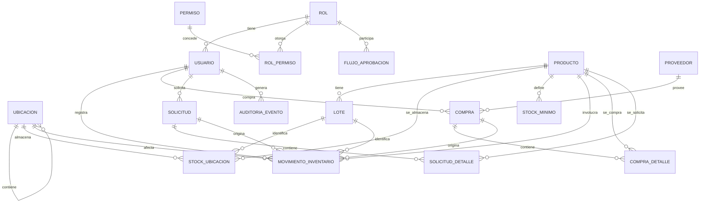

# Plan inicial de proyecto — Sistema de Control de Inventario

## 1. Metodología de trabajo

**Contexto**: proyecto desarrollado por **una sola persona**, dedicando **fines de semana / ratos libres** (no tiempo completo). Esto hace que un Scrum clásico con ceremonias diarias y sprints rígidos de 2 semanas no sea realista, así que se adapta a **Scrumban**: se conservan los artefactos de Scrum que dan estructura y visibilidad (backlog priorizado, HU, DoR/DoD, iteraciones con demo/retro personal), pero se elimina el timeboxing estricto y las ceremonias diseñadas para equipos.

**Por qué no Kanban puro**: igual se necesita una meta de alcance por iteración (para poder probar el MVP en partes y no dejar todo para el final), así que se mantienen iteraciones — solo que más largas y flexibles que un sprint de equipo.

**Rol único (desarrollo)**: asumes Product Owner + desarrollador. No hay Scrum Master como tal — su función (disciplina de proceso, no acumular trabajo a medio hacer) queda como autogestión apoyada en el tablero Kanban y el WIP limit.

**Rol adicional — Usuario funcional / validador**: persona externa al desarrollo que da el **VoBo** de cada entrega. Con el roadmap dividido en varios MVPs (sección 3.1), su validación deja de ser un único gate al final del proyecto: **revisa cada MVP a medida que se entrega**, probando directamente en el ambiente de staging (self-service). Esto da retroalimentación temprana — si algo no cumple la expectativa real del negocio, se detecta al cierre de MVP 1 (mes 3-4) y no al cierre de MVP 4 (mes 8-9).

**Tablero personal** (Trello, GitHub Projects o Jira personal): columnas `Backlog` → `En progreso` (WIP limit: 1-2 HU a la vez, para evitar dispersión) → `En pruebas` → `Hecho`.

**Ritmo de trabajo**:
- **Iteración**: 3-4 semanas de calendario (equivalente a "sprint", pero dimensionado a la disponibilidad real de fines de semana, no a días corridos)
- **Revisión personal** al cierre de cada iteración: ¿la HU cumple los criterios de aceptación? ¿qué se corrige antes de seguir? (reemplaza el Sprint Review/Retro de equipo)
- Es preferible **menos HU por iteración pero completamente probadas**, que muchas a medias — así se cumple tu premisa de corregir errores antes de avanzar.

**Definition of Ready (DoR)** — una HU está lista para trabajar si tiene:
- Criterios de aceptación claros y verificables (recuerda: nadie más los va a revisar hasta el final)
- Diseño de UI (si aplica) o wireframe mínimo
- Dependencias técnicas identificadas

**Definition of Done (DoD)** — una HU está terminada si:
- Código revisado (autorrevisión con checklist, ver sección 5)
- Tests unitarios y/o BDD pasando
- Desplegado en ambiente de staging
- Autovalidada contra los criterios de aceptación (la validación del usuario funcional llega al cierre del MVP al que pertenece la HU, sección 3.1 y 6)

---

## 2. Levantamiento de requerimientos

### 2.1 Requerimientos funcionales (resumen por módulo)

| Módulo | Requerimiento |
|---|---|
| Proveedores | CRUD de proveedores, datos de contacto, histórico de compras asociado |
| Ubicaciones | CRUD de ubicaciones/salas, relación de inventario a ubicación |
| Inventario | Registro de stock por producto+ubicación, movimientos (entrada/salida/traslado), soporte opcional de lote/vencimiento por producto |
| Alertas | Notificación cuando stock de un producto en una ubicación baja del mínimo configurado |
| Compras | Registro de órdenes de compra a proveedor (cantidad, precio, fecha), histórico completo |
| Comparativa de precios | Reporte de precio de un mismo producto entre distintos proveedores a lo largo del tiempo |
| Solicitudes | Solicitud de compra a proveedor y solicitud de consumo interno, con flujo de aprobación |
| Roles y permisos | Control de acceso por rol a módulos y acciones específicas |
| Autenticación | Login seguro, sesión, recuperación de contraseña |

### 2.2 Requerimientos no funcionales

- **Seguridad**: ver épica dedicada (sección 3, Epic 8) y checklist de mitigación OWASP Top 10 (sección 4.7). Es un requerimiento transversal: cada HU de negocio debe pasar por validación de entrada, control de acceso en backend y manejo seguro de errores, no solo las HU de seguridad explícitas.
- **Escalabilidad**: arquitectura modular que permita crecer de decenas a cientos de usuarios sin rediseño
- **Trazabilidad**: todo movimiento de inventario y toda aprobación de solicitud debe quedar registrado de forma inmutable (quién, cuándo, qué)
- **Disponibilidad**: aceptable para escala pequeña con despliegue en capa gratuita inicialmente
- **Usabilidad**: interfaz clara para roles no técnicos (ej. encargados de bodega)

---

## 3. Historias de usuario (HU) — backlog inicial priorizado

> Formato: *Como [rol], quiero [acción], para [beneficio]*. Priorización con MoSCoW (Must/Should/Could).

### Epic 1 — Autenticación y roles
- **HU-01** (Must) Como usuario, quiero iniciar sesión con usuario y contraseña, para acceder al sistema de forma segura.
  - Criterio: credenciales inválidas muestran error; login exitoso redirige según rol.
- **HU-02** (Must) Como administrador, quiero crear roles y asignar permisos por módulo/acción, para controlar qué puede hacer cada usuario.
  - Criterio: un usuario sin permiso no puede ver ni ejecutar la acción restringida (validado en backend).
- **HU-03** (Must) Como administrador, quiero asignar un rol a cada usuario, para que el sistema aplique sus permisos.

### Epic 2 — Proveedores
- **HU-04** (Must) Como comprador, quiero registrar un proveedor con sus datos de contacto, para poder asociarle compras.
- **HU-05** (Must) Como comprador, quiero ver el histórico de compras de un proveedor, para evaluar su desempeño.

### Epic 3 — Ubicaciones
- **HU-06** (Must) Como administrador de inventario, quiero crear ubicaciones/salas, para organizar dónde se almacena el inventario.
- **HU-07** (Must) Como administrador de inventario, quiero asociar productos/stock a una ubicación específica, para saber qué hay y dónde.

### Epic 4 — Catálogo e inventario
- **HU-28** (Must) Como administrador de inventario, quiero crear y editar productos del catálogo (nombre, descripción, unidad de medida, categoría), para poder gestionar inventario, compras y solicitudes sobre ellos.
  - *Nota de validación: esta HU faltaba en el backlog original — las demás HU de inventario, compras y solicitudes dependen de que el producto exista primero.*
  - *Nota TT-23: unidad de medida y categoría se seleccionan desde catálogos administrables (CATEGORIA, UNIDAD_MEDIDA — ver sección 7.2), no se escriben como texto libre. Requiere que el administrador de inventario pueda dar de alta valores nuevos en esos catálogos antes o durante la creación de un producto.*
- **HU-08** (Must) Como administrador de inventario, quiero registrar entradas y salidas de stock por ubicación, para mantener el inventario actualizado.
- **HU-09** (Must) Como administrador de inventario, quiero marcar un producto como "requiere lote/vencimiento", para trazar productos perecederos de forma distinta a los que no lo son.
  - *Reclasificada de Should a Must: confirmaste que "depende del producto" — es una necesidad real de negocio, no un extra.*
- **HU-10** (Must) Como cualquier usuario autorizado, quiero consultar el stock actual por producto y ubicación, para tomar decisiones informadas.
- **HU-26** (Should) Como administrador de inventario, quiero adjuntar una imagen a cada producto, para identificarlo visualmente en el sistema.
  - Criterio: solo se aceptan formatos jpg/png/webp, tamaño máximo definido (ej. 5MB); el archivo se almacena en Cloudflare R2 (no en el servidor de la app) y se sirve mediante URL, no se referencia por ruta local.

### Epic 5 — Alertas
- **HU-11** (Must) Como administrador de inventario, quiero definir un stock mínimo por producto/ubicación, para recibir alertas antes de que se agote.
- **HU-12** (Must) Como usuario del sistema, quiero ver un panel de productos en alerta, para actuar rápidamente.
  - *Reclasificada de Should a Must: una alerta sin forma de verla no cumple el requerimiento original de "alertas de items a acabarse".*

### Epic 6 — Compras y comparativa de precios
- **HU-13** (Must) Como comprador, quiero registrar una compra a un proveedor con cantidades y precios, para actualizar el inventario y el histórico.
- **HU-14** (Must) Como comprador, quiero comparar el precio de un mismo producto entre distintos proveedores, para decidir con quién comprar.
  - *Reclasificada de Should a Must: la comparativa de precios fue uno de los requerimientos explícitos desde tu primer mensaje, no un extra.*

### Epic 7 — Solicitudes
- **HU-15** (Must) Como usuario solicitante, quiero crear una solicitud de compra a proveedor, para pedir reposición de inventario.
- **HU-16** (Must) Como usuario solicitante, quiero crear una solicitud de consumo interno, para retirar inventario de una ubicación.
- **HU-17** (Must) Como aprobador, quiero aprobar o rechazar una solicitud, para controlar las salidas y compras.
  - Criterio: el flujo de aprobación debe ser configurable (hoy 1 aprobador, a futuro multi-nivel) sin cambiar el modelo de datos.
- **HU-18** (Could) Como administrador, quiero configurar niveles de aprobación por tipo de solicitud, para adaptarse a la estructura organizacional futura.

### Epic 8 — Seguridad (transversal)
> Esta épica combina HU específicas de seguridad con criterios que aplican a **todas** las HU de negocio ya listadas (validación de entrada y control de acceso en backend, no solo en frontend).

- **HU-19** (Must) Como sistema, quiero exigir una política mínima de contraseñas y almacenarlas hasheadas (nunca en texto plano), para prevenir accesos no autorizados si la base de datos se filtra.
- **HU-20** (Must) Como sistema, quiero limitar y bloquear temporalmente intentos de login fallidos repetidos, para prevenir ataques de fuerza bruta.
- **HU-21** (Must) Como sistema, quiero validar y sanear toda entrada de usuario en el backend (no solo en el frontend), para prevenir inyección SQL, XSS y payloads maliciosos.
  - Criterio: ninguna consulta se construye por concatenación de strings; todo pasa por el ORM (queries parametrizadas) y DTOs validados.
- **HU-22** (Must) Como sistema, quiero forzar HTTPS y aplicar cabeceras de seguridad HTTP (CSP, HSTS, X-Frame-Options, etc.), para mitigar ataques comunes de red y de navegador.
- **HU-23** (Should) Como administrador, quiero un registro de auditoría de acciones sensibles (login, cambios de rol, aprobaciones de solicitudes), para poder investigar cualquier incidente.
- **HU-24** (Must) Como desarrollador, quiero que las dependencias del proyecto se escaneen automáticamente por vulnerabilidades conocidas en cada build, para no introducir librerías inseguras sin darme cuenta.
  - *Reclasificada de Should a Must: es prácticamente gratis de activar (Dependabot) y el costo de omitirla es alto dado el énfasis en seguridad.*
- **HU-25** (Could) Como administrador, quiero poder habilitar autenticación de dos factores (2FA) para cuentas con permisos altos, para reforzar el acceso a las cuentas más sensibles.
- **HU-27** (Should) Como sistema, quiero validar tipo, tamaño y contenido de cualquier archivo subido por un usuario (ej. imágenes de producto) antes de almacenarlo, para prevenir subida de archivos maliciosos.
  - Criterio: validación en backend (no solo en frontend) de extensión y tipo MIME real del archivo; el almacenamiento va a Cloudflare R2 con URL firmada de subida, nunca escribiendo directo al disco del servidor de aplicación.

### Epic 9 — UI: idioma y tema (post-MVP, al final de todo)
> Agregado a pedido explícito, después de cerrar el alcance original (MVP 4). No bloquea ninguna funcionalidad de negocio — se aborda al final.

- **HU-29** (Could) Como usuario, quiero poder cambiar el idioma de la interfaz entre español e inglés, para usar el sistema en mi idioma preferido.
  - Criterio: selector de idioma visible en la UI; la preferencia persiste (localStorage o perfil de usuario); todo el texto de la interfaz (labels, botones, mensajes de validación) responde al cambio. Implementación sugerida: Angular i18n o `ngx-translate`.
- **HU-30** (Could) Como usuario, quiero poder cambiar entre modo claro y modo oscuro, para adaptar la interfaz a mi preferencia visual.
  - Criterio: selector visible; la preferencia persiste; aplica de forma consistente a todos los componentes de Angular Material vía theming (no solo a colores sueltos).

---

## 3.1 Roadmap de MVPs — entregas incrementales

Un solo MVP de 23 HU con validación externa hasta el mes 8-10 no es realmente "mínimo" — es un release completo con nombre de MVP. Se divide en **5 entregas incrementales**, cada una con su propio checkpoint de validación con el usuario funcional. El criterio de agrupación es **valor de negocio coherente y usable**, no cantidad arbitraria de HU — cada MVP debe poder probarse de forma independiente y con sentido de negocio propio.

| MVP | Epics/HU incluidas | Valor entregado | ¿Qué puede hacer el usuario funcional al terminar? |
|---|---|---|---|
| **MVP 1 — Núcleo** | HU-01,02,03,19,20,21,22 (auth+RBAC+seguridad base) + HU-06,07,28 (ubicaciones+catálogo) + HU-08,09,10 (inventario) | Control de inventario por ubicación, con acceso seguro | Crear ubicaciones, productos, registrar movimientos y consultar stock |
| **MVP 2 — Abastecimiento** | HU-04,05 (proveedores) + HU-13,14 (compras+comparativa) | Gestión de compras y proveedores | Registrar proveedores, compras, y comparar precios entre ellos |
| **MVP 3 — Alertas** | HU-11,12 | Prevención de quiebre de stock | Configurar mínimos y ver el panel de productos en alerta |
| **MVP 4 — Solicitudes** | HU-15,16,17 | Control de solicitudes internas | Crear y aprobar solicitudes de compra y de consumo — **con esto se cumplen todos los requerimientos de tu planteamiento original** |
| **MVP 5 — Refuerzo** *(opcional, post-MVP)* | HU-18,23,25,26,27 | Mejoras que no bloquean el uso real | Aprobación multi-nivel, panel de auditoría, 2FA, imágenes de producto |
| **MVP 6 — Personalización de UI** *(opcional, al final de todo)* | HU-29,30 | Comodidad de uso, no funcionalidad de negocio | Cambiar idioma (ES/EN) y tema (claro/oscuro) de la interfaz |

**MVP 4 es el hito clave**: ahí termina el alcance que definiste en tu primer mensaje (proveedores, inventario por ubicación, alertas, historial de compras, comparativa de precios, RBAC, solicitudes). MVP 5 puede posponerse indefinidamente sin afectar el uso real del sistema — por eso queda marcado como opcional.

**HU-24** (escaneo de dependencias) no aparece en ningún MVP de la tabla porque es infraestructura que se activa una sola vez en el setup (It. 0) y queda corriendo en todo el proyecto, no es una entrega de valor visible al usuario.

## 3.2 Tareas técnicas de aprovisionamiento (Iteración 0)

Estas tareas **no son HU** — no tienen forma "como [rol] quiero [beneficio de negocio]" porque no entregan valor directo al usuario funcional, son prerrequisito técnico para que cualquier HU pueda desplegarse. En Scrum se manejan como **tareas técnicas / chores**, un tipo de ítem de backlog distinto a la HU, pero igual de necesario de planear — por eso no estaban desglosadas antes, solo mencionadas como una línea genérica de "Setup".

| ID | Tarea técnica | Detalle |
|---|---|---|
| TT-01 | Crear repositorio(s) en GitHub | Definir si es monorepo o repos separados (front/back); estructura de carpetas inicial |
| TT-02 | Definir estrategia de branching | Ej. `main` (producción) / `staging` / `feature/*`, con reglas de protección de rama |
| TT-03 | Aprovisionar cuenta y proyecto en **Vercel** (frontend) | Conectar al repo, configurar build de Angular, dominio provisional |
| TT-04 | Aprovisionar servicio en **Render** o **Fly.io** (backend) | Conectar al repo, configurar build de NestJS, variables de entorno |
| TT-05 | Aprovisionar base de datos en **Neon** o **Supabase** (Postgres) | Crear instancia, obtener connection string, configurar como secret |
| TT-06 | Aprovisionar **Cloudflare** (plan gratuito) | Configurar dominio/proxy, WAF básico; crear bucket en **R2** para imágenes |
| TT-07 | Configurar **GitHub Actions** — pipeline CI | Jobs de lint → type-check → tests (unit/BDD) en cada PR |
| TT-08 | Configurar **GitHub Actions** — pipeline CD | Deploy automático a `staging` en PR aprobado, a `production` en merge a `main` |
| TT-09 | Configurar **Dependabot** + gate de `npm audit` en CI (HU-24) | Bloquear build si aparece vulnerabilidad crítica conocida |
| TT-10 | Gestión de secrets | Variables de entorno y credenciales cargadas como secrets de GitHub Actions y de cada proveedor — nunca en el repo |
| TT-11 | Endpoint de health-check en el backend | Para verificar que el deploy fue exitoso y monitorear disponibilidad básica |
| TT-12 | Configurar Prisma + primera migración | Esquema inicial vacío, conexión verificada a la BD de staging |

*(TT-13 — Docker para desarrollo local — se agregó después del análisis de la sección 9.3, ver esa sección)*

**Definition of Done de la Iteración 0** (distinta de la DoD de HU, sección 1): pipeline en verde end-to-end, un cambio de código trivial se despliega automáticamente a `staging` sin intervención manual, y el health-check responde correctamente. Solo con esto cerrado se empieza la Iteración 1 (HU de negocio).

Estas 4 HU quedan en el backlog, listas para retomarse justo después del VoBo, sin necesidad de replanear nada — es la ventaja de haberlas dejado ya escritas con criterios de aceptación.

---

## 4. Propuesta de solución — Stack tecnológico

### 4.1 Arquitectura general
**Monolito modular** con arquitectura hexagonal por módulo (dominio → aplicación → infraestructura → interfaz REST). Se descarta microservicios para el MVP por la escala pequeña definida (evita complejidad operativa innecesaria); el diseño modular permite extraer un módulo a servicio independiente en el futuro si la escala lo justifica.

### 4.2 Frontend

| Componente | Elección | Justificación |
|---|---|---|
| Framework | **Angular 18+** (standalone components) | Tipado fuerte nativo, estructura modular alineada al dominio, Router+Guards para RBAC en UI |
| Lenguaje | TypeScript | Consistencia de tipos end-to-end con el backend |
| UI Kit | **Angular Material** | Componentes de tabla, formularios y dashboards listos para producción |
| Manejo de estado servidor | **Angular signals** + `HttpClient` (o NgRx si el estado global crece) | Empezar simple; escalar a NgRx solo si la complejidad de estado lo amerita |
| Formularios | Reactive Forms + validadores tipados | Formularios de solicitudes, proveedores, inventario con validación robusta |
| Testing | Jasmine/Karma (unit, viene con Angular CLI) + **Playwright** (E2E) | Cobertura de lógica de componentes y flujos completos de usuario |

### 4.3 Backend

| Componente | Elección | Justificación |
|---|---|---|
| Framework | **NestJS** (Node.js LTS 20+) | Arquitectura modular nativa, decoradores para RBAC (`@Roles`, Guards), DI integrada |
| Lenguaje | TypeScript | Tipado estricto en toda la lógica de negocio |
| ORM | **Prisma** | Migraciones simples, tipado end-to-end del esquema de BD, buena DX |
| Validación | `class-validator` + `class-transformer` (DTOs) | Validación de entrada tipada y declarativa |
| Autenticación | JWT (`@nestjs/jwt`) + Passport.js | Estándar de facto, se integra nativo con NestJS |
| Autorización | Guards + decoradores custom (`@Roles`, `@Permissions`) | RBAC granular por módulo/acción, validado en backend (no solo en UI) |
| Documentación API | Swagger/OpenAPI (`@nestjs/swagger`) | Generación automática desde los mismos decoradores del código |
| Testing | Jest (unit + integration) + `jest-cucumber` (BDD) | Ver sección 5 de estrategia de testing |

### 4.4 Base de datos

| Componente | Elección | Justificación |
|---|---|---|
| Motor | **PostgreSQL 16** | Dominio fuertemente relacional, integridad transaccional para movimientos de inventario, soporte JSONB si se necesitan campos flexibles a futuro |
| Migraciones | Prisma Migrate | Versionado del esquema junto con el código |

### 4.5 Infraestructura y despliegue (capa gratuita)

| Componente | Elección |
|---|---|
| Hosting frontend | **Vercel** (o Netlify) |
| Hosting backend | **Render** o **Fly.io** |
| Base de datos gestionada | **Neon** o **Supabase** (Postgres serverless) |
| Almacenamiento de imágenes | **Cloudflare R2**: 10GB, 1M escrituras y 10M lecturas/mes gratis, egress siempre gratis (imágenes de producto — HU-26) |
| Proxy / WAF / DDoS | **Cloudflare (plan gratuito)** delante del dominio: WAF básico, protección DDoS, rate limiting a nivel de red (refuerza HU-20, HU-22) |
| Control de versiones | GitHub |
| CI/CD | **GitHub Actions**: pipeline de lint → type-check → tests (unit/BDD) → build → deploy automático a `staging` en cada PR aprobado, y a `production` en merge a `main` |

### 4.6 Herramientas de soporte

| Herramienta | Uso |
|---|---|
| ESLint + Prettier | Consistencia de estilo de código en front y back |
| Husky + lint-staged | Hooks de pre-commit (lint/format antes de commitear) |
| Conventional Commits | Historial de commits legible, facilita changelog automático |

### 4.7 Seguridad — herramientas y checklist (Epic 8)

| Herramienta / práctica | Uso |
|---|---|
| `helmet` (NestJS) | Cabeceras de seguridad HTTP por defecto (CSP, HSTS, X-Frame-Options, etc.) — HU-22 |
| `@nestjs/throttler` | Rate limiting sobre endpoints sensibles (login, creación de solicitudes) — HU-20 |
| `class-validator` / DTOs | Validación estricta de toda entrada al backend — HU-21 (ya definido en 4.3, reforzado aquí) |
| Prisma (queries parametrizadas) | Previene inyección SQL por diseño, siempre que no se usen queries raw sin parametrizar — HU-21 |
| `bcrypt`/`argon2` | Hasheo de contraseñas, nunca texto plano ni hashes reversibles — HU-19 |
| GitHub Dependabot (gratuito) | Escaneo automático de dependencias vulnerables en cada PR — HU-24 |
| `npm audit` en el pipeline CI | Bloquea el build si aparece una vulnerabilidad crítica conocida — HU-24 |
| HTTPS forzado | Provisto automáticamente por Vercel/Render/Fly.io en sus dominios — HU-22 |
| Variables de entorno / secrets | Credenciales y llaves nunca en el repo; gestionadas como secrets de GitHub Actions y del proveedor de hosting |
| Logging de auditoría | Tabla de eventos sensibles (login, cambios de rol, aprobaciones) con actor, timestamp y acción — HU-23 |
| **Cloudflare (plan gratuito)** | WAF básico + protección DDoS delante del dominio; refuerza HU-20 y HU-22 a nivel de red, sin costo — HU-22 |
| **Cloudflare R2 + validación de archivos** | Imágenes de producto fuera del servidor de aplicación, con validación de tipo/tamaño/MIME real antes de subir — HU-26, HU-27 |

**Checklist OWASP Top 10 — mitigación por capa**:

| Riesgo OWASP | Mitigación en este proyecto |
|---|---|
| Broken Access Control | RBAC validado en backend (Guards de NestJS), nunca solo en el frontend |
| Cryptographic Failures | HTTPS forzado, contraseñas hasheadas con `bcrypt`/`argon2`, secrets fuera del repo |
| Injection (SQL/XSS) | Queries parametrizadas vía Prisma, DTOs validados con `class-validator`, Angular escapa HTML por defecto |
| Insecure Design | Modelado de roles/permisos y flujo de aprobación desde el diseño (secciones 3 y 4), no como parche |
| Security Misconfiguration | `helmet` con configuración explícita, sin endpoints de debug en producción, WAF de Cloudflare como capa adicional |
| Unrestricted File Upload | Validación de tipo/tamaño/MIME real en backend, almacenamiento en Cloudflare R2 (no en disco del servidor) — HU-26, HU-27 |
| Vulnerable Components | Dependabot + `npm audit` en CI/CD |
| Auth Failures | Rate limiting + bloqueo temporal en login, política de contraseñas |
| Software/Data Integrity | Pipeline CI/CD con checks obligatorios antes de deploy, commits firmados (opcional) |
| Logging Failures | Log de auditoría de acciones sensibles (HU-23) |
| SSRF | No aplica de forma crítica al MVP (sin llamadas a URLs arbitrarias controladas por el usuario); revisar si se agregan integraciones externas a futuro |

---

## 5. Estrategia de testing: TDD y BDD combinados

No son excluyentes — se usan en capas distintas del proyecto:

- **BDD (Behavior Driven Development)** para las **historias de usuario con lógica de negocio compleja o flujos críticos** (solicitudes y su aprobación, RBAC, alertas). Se escriben escenarios en Gherkin (`Given/When/Then`) junto con el Product Owner *antes* de codificar, y sirven como criterios de aceptación ejecutables.
  - Herramienta sugerida: `jest-cucumber` (se integra bien con NestJS y Jest) o Cucumber.js.
  - Ejemplo:
    ```gherkin
    Escenario: Aprobación de solicitud de consumo interno
      Dado que existe una solicitud de consumo pendiente
      Cuando el aprobador la aprueba
      Entonces el stock de la ubicación debe disminuir en la cantidad solicitada
      Y la solicitud debe quedar en estado "completada"
    ```

- **TDD (Test Driven Development)** para la **lógica de dominio pura y crítica**: cálculo de stock, validación de movimientos de inventario, comparativa de precios. Aquí el desarrollador escribe el test unitario antes del código de producción.
  - Herramienta: Jest (ya integrado en NestJS).

- **Testing E2E**: Playwright o Cypress para flujos completos en Angular (login → crear solicitud → aprobar → verificar stock), corridos en el pipeline de CI/CD antes de desplegar a producción.

**Regla práctica**: si el error de esa lógica cuesta caro (dinero, inventario mal contado, acceso indebido) → TDD/BDD obligatorio antes de mergear. Si es una pantalla simple de solo lectura, con test E2E básico es suficiente.

---

## 6. Cronograma de desarrollo (iteraciones de 3-4 semanas, ritmo de fin de semana)

Reordenado para que las iteraciones sigan la secuencia de MVPs de la sección 3.1 (antes estaban agrupadas solo por módulo técnico; ahora cada bloque termina en un checkpoint de validación con el usuario funcional).

### MVP 1 — Núcleo

| Iteración | Objetivo | Entregable probado |
|---|---|---|
| It. 0 (2-3 sem) | Setup de infraestructura — ver detalle completo de tareas técnicas TT-01 a TT-12 en sección 3.2 | Pipeline funcionando end-to-end, "hello world" desplegado automáticamente a staging con cabeceras de seguridad activas |
| It. 1 | Autenticación + Roles/RBAC + seguridad de acceso (HU-01, 02, 03, 19, 20) | Login funcional con política de contraseñas, bloqueo por intentos fallidos, RBAC validado en backend |
| It. 2 | Ubicaciones + catálogo de productos (HU-06, 07, 28) + validación de entrada (HU-21) | CRUD de ubicaciones y productos |
| It. 3 | Inventario (HU-08, 09, 10, 22) | Movimientos de stock, soporte de lote/vencimiento, consulta de stock, HTTPS/cabeceras forzadas |
| **It. 4 — UAT MVP 1** (1-2 sem) | Usuario funcional prueba en staging contra checklist de HU-01 a HU-10/19-22/28 | **VoBo MVP 1** o ajustes a corregir antes de seguir |

### MVP 2 — Abastecimiento

| Iteración | Objetivo | Entregable probado |
|---|---|---|
| It. 5 | Proveedores (HU-04, 05) | CRUD de proveedores + histórico de compras (vacío aún) |
| It. 6 | Compras + comparativa de precios (HU-13, 14) | Registro de compras, actualiza inventario e histórico, reporte comparativo |
| **It. 7 — UAT MVP 2** (1-2 sem) | Usuario funcional prueba proveedores + compras | **VoBo MVP 2** o ajustes |

### MVP 3 — Alertas

| Iteración | Objetivo | Entregable probado |
|---|---|---|
| It. 8 | Alertas (HU-11, 12) | Configuración de mínimos, panel de productos en alerta |
| **It. 9 — UAT MVP 3** (1 sem) | Usuario funcional prueba alertas | **VoBo MVP 3** o ajustes |

### MVP 4 — Solicitudes (cierre del alcance original)

| Iteración | Objetivo | Entregable probado |
|---|---|---|
| It. 10 | Solicitudes — creación (HU-15, 16) | Formularios de solicitud de compra y de consumo interno |
| It. 11 | Solicitudes — aprobación (HU-17) + hardening final (checklist OWASP completo, testing E2E) | Flujo de aprobación funcional, MVP estable en staging |
| **It. 12 — UAT MVP 4** (1-2 sem) | Usuario funcional prueba el flujo de solicitudes y el sistema completo de punta a punta | **VoBo MVP 4 — sistema completo según el planteamiento original** |

### MVP 5 — Refuerzo (opcional, post-MVP)

| Iteración | Objetivo | Entregable probado |
|---|---|---|
| It. 13 | Aprobación multi-nivel + panel de auditoría + 2FA + imágenes de producto (HU-18, 23, 25, 26, 27) | Mejoras adicionales sobre el sistema ya funcional |
| **It. 14 — UAT MVP 5** | Usuario funcional prueba las mejoras | **VoBo MVP 5** |

### MVP 6 — Personalización de UI (opcional, al final de todo)

| Iteración | Objetivo | Entregable probado |
|---|---|---|
| It. 15 | Selector de idioma ES/EN + modo claro/oscuro (HU-29, HU-30) | UI completamente traducible y con tema configurable |
| **It. 16 — UAT MVP 6** | Usuario funcional prueba el cambio de idioma y tema | **VoBo MVP 6** |

---

**Estimado total**:

| Hito | Semanas acumuladas | Meses aprox. |
|---|---|---|
| VoBo MVP 1 | ~12-14 sem | ~3 meses |
| VoBo MVP 2 | ~20-22 sem | ~5 meses |
| VoBo MVP 3 | ~24-26 sem | ~6 meses |
| **VoBo MVP 4 (sistema completo)** | ~32-35 sem | **~8 meses** |
| VoBo MVP 5 (opcional) | ~38-40 sem | ~9-10 meses |
| VoBo MVP 6 (opcional, al final) | ~41-43 sem | ~10 meses |

Sujeto a ajuste tras el cierre de MVP 1, cuando tengas una medida real de tu propio ritmo — es preferible recalibrar temprano que sobre-prometer. Nota que el hito clave para el negocio (sistema completo, ~8 meses) llega antes que el estimado anterior de "8-10 meses para un solo MVP" — la diferencia es que ahora hay 4 validaciones externas en el camino en vez de una sola al final.

Cada iteración de desarrollo termina con **revisión personal** (criterios de aceptación cumplidos, corregir antes de avanzar). Cada bloque de MVP termina además con **revisión externa del usuario funcional** — dos capas de control de calidad, no una.

**Cómo preparar cada checkpoint de UAT** (el usuario prueba solo, sin acompañamiento):
- Entregar una **guía de pruebas** por MVP, basada en las HU y criterios de aceptación de ese bloque (sección 3): *"Como [rol], deberías poder hacer [X]. Márcalo si funciona, describe el problema si no."*
- Mantener el ambiente de staging con **datos de ejemplo realistas**, acumulativos entre MVPs (los datos de MVP 1 siguen ahí cuando se prueba MVP 2, etc.)
- Canal simple y trazable para reportar hallazgos (hoja de cálculo compartida o issues en GitHub)
- El VoBo de cada MVP se da cuando todas sus HU pasan el checklist; los ajustes encontrados se corrigen **antes de empezar el siguiente MVP**, no se acumulan

**Recomendación práctica para no perder impulso en un proyecto solo/part-time**: al cerrar cada iteración, deja un commit desplegado y funcional en `staging`, aunque sea pequeño. Es más fácil retomar un proyecto en un estado "funciona, aunque incompleto" que uno a medio romper.

---

## 7. Modelo Entidad-Relación (MER)

Diseñado a partir de todas las HU del backlog (secciones 3 y 3.1). Dos decisiones de diseño importantes, ya explicadas antes en la conversación, que se reflejan aquí:

- **Los movimientos de inventario son la fuente de verdad** (`MOVIMIENTO_INVENTARIO`, tabla inmutable tipo bitácora); `STOCK_UBICACION` es una tabla derivada/materializada que se actualiza en la misma transacción que cada movimiento, para lectura rápida sin tener que sumar el histórico completo cada vez.
- **El flujo de aprobación es configurable** (`FLUJO_APROBACION`), no un campo fijo `aprobado_por` en `SOLICITUD` — así se soporta desde el MVP el escenario de "hoy un aprobador, a futuro jefe directo → Admin Inventario" sin rediseñar el esquema.

### 7.1 Diagrama de entidad-relación



*(Este bloque `mermaid` se puede abrir directamente en GitHub, VS Code o cualquier visor compatible con Mermaid para ver el diagrama renderizado.)*

### 7.2 Entidades y atributos

**ROL**
| Campo | Tipo | Notas |
|---|---|---|
| id | uuid PK | |
| nombre | string | ej. Admin, Comprador, Encargado de bodega |
| descripcion | string | |

**PERMISO**
| Campo | Tipo | Notas |
|---|---|---|
| id | uuid PK | |
| modulo | string | ej. `inventario`, `compras`, `solicitudes` |
| accion | string | ej. `leer`, `crear`, `aprobar` |

**ROL_PERMISO** (tabla de unión N:M)
| Campo | Tipo | Notas |
|---|---|---|
| rol_id | uuid FK → ROL | |
| permiso_id | uuid FK → PERMISO | |

**USUARIO**
| Campo | Tipo | Notas |
|---|---|---|
| id | uuid PK | |
| nombre | string | |
| email | string, único | |
| password_hash | string | bcrypt/argon2 — HU-19 |
| rol_id | uuid FK → ROL | un rol por usuario, según HU-03 |
| estado | enum | activo / bloqueado (bloqueo por intentos fallidos — HU-20) |
| fecha_creacion | timestamp | |

**UBICACION**
| Campo | Tipo | Notas |
|---|---|---|
| id | uuid PK | |
| nombre | string | |
| ubicacion_padre_id | uuid FK → UBICACION, nullable | jerarquía opcional (sede → sala) |
| estado | enum | activa / inactiva |

**CATEGORIA** (catálogo administrable — TT-23, ADR-23)
| Campo | Tipo | Notas |
|---|---|---|
| id | uuid PK | |
| nombre | string, único | |
| estado | enum | activa / inactiva |

**UNIDAD_MEDIDA** (catálogo administrable — TT-23, ADR-23)
| Campo | Tipo | Notas |
|---|---|---|
| id | uuid PK | |
| nombre | string, único | ej. unidad, kg, litro |
| estado | enum | activa / inactiva |

**PRODUCTO**
| Campo | Tipo | Notas |
|---|---|---|
| id | uuid PK | |
| nombre | string | |
| descripcion | string | |
| unidad_medida_id | uuid FK → UNIDAD_MEDIDA | selección desde catálogo, no texto libre (TT-23) |
| categoria_id | uuid FK → CATEGORIA, nullable | selección desde catálogo, no texto libre (TT-23) |
| requiere_lote | boolean | define si aplica LOTE — HU-09 |
| imagen_url | string, nullable | URL en Cloudflare R2 — HU-26 (post-MVP) |
| estado | enum | activo / descontinuado |

**LOTE** *(solo aplica si `producto.requiere_lote = true`)*
| Campo | Tipo | Notas |
|---|---|---|
| id | uuid PK | |
| producto_id | uuid FK → PRODUCTO | |
| numero_lote | string | |
| fecha_vencimiento | date, nullable | |
| fecha_ingreso | date | |

**STOCK_UBICACION** *(tabla derivada — cantidad actual)*
| Campo | Tipo | Notas |
|---|---|---|
| id | uuid PK | |
| producto_id | uuid FK → PRODUCTO | |
| ubicacion_id | uuid FK → UBICACION | |
| lote_id | uuid FK → LOTE, nullable | solo si el producto requiere lote |
| cantidad | decimal | se actualiza junto con cada MOVIMIENTO_INVENTARIO, en la misma transacción |

*Restricción única: (producto_id, ubicacion_id, lote_id) — un solo registro de cantidad por combinación.*

**STOCK_MINIMO**
| Campo | Tipo | Notas |
|---|---|---|
| id | uuid PK | |
| producto_id | uuid FK → PRODUCTO | |
| ubicacion_id | uuid FK → UBICACION | |
| cantidad_minima | decimal | dispara alerta (HU-11/12) cuando `STOCK_UBICACION.cantidad` baja de este valor |

**MOVIMIENTO_INVENTARIO** *(bitácora inmutable — fuente de verdad)*
| Campo | Tipo | Notas |
|---|---|---|
| id | uuid PK | |
| producto_id | uuid FK → PRODUCTO | |
| ubicacion_id | uuid FK → UBICACION | |
| lote_id | uuid FK → LOTE, nullable | |
| tipo | enum | `entrada`, `salida`, `traslado_entrada`, `traslado_salida`, `ajuste` |
| cantidad | decimal | siempre positiva; el `tipo` define el signo del efecto |
| usuario_id | uuid FK → USUARIO | quién registró el movimiento |
| compra_id | uuid FK → COMPRA, nullable | si el movimiento viene de una compra |
| solicitud_id | uuid FK → SOLICITUD, nullable | si el movimiento viene de una solicitud aprobada |
| fecha | timestamp | |
| observacion | string, nullable | |

**PROVEEDOR**
| Campo | Tipo | Notas |
|---|---|---|
| id | uuid PK | |
| nombre | string | |
| nit | string | |
| contacto | string | |
| telefono | string | |
| email | string | |
| estado | enum | activo / inactivo |

**COMPRA**
| Campo | Tipo | Notas |
|---|---|---|
| id | uuid PK | |
| proveedor_id | uuid FK → PROVEEDOR | |
| usuario_id | uuid FK → USUARIO | comprador que registró la compra |
| fecha | date | |
| estado | enum | registrada / recibida |

**COMPRA_DETALLE**
| Campo | Tipo | Notas |
|---|---|---|
| id | uuid PK | |
| compra_id | uuid FK → COMPRA | |
| producto_id | uuid FK → PRODUCTO | |
| cantidad | decimal | |
| precio_unitario | decimal | insumo directo de la comparativa de precios — HU-14 |

**SOLICITUD**
| Campo | Tipo | Notas |
|---|---|---|
| id | uuid PK | |
| tipo | enum | `compra`, `consumo` |
| solicitante_id | uuid FK → USUARIO | |
| aprobador_id | uuid FK → USUARIO, nullable | se llena al aprobar/rechazar |
| estado | enum | `pendiente`, `aprobada`, `rechazada`, `completada` |
| fecha_creacion | timestamp | |
| fecha_resolucion | timestamp, nullable | |
| observacion | string, nullable | |

**SOLICITUD_DETALLE**
| Campo | Tipo | Notas |
|---|---|---|
| id | uuid PK | |
| solicitud_id | uuid FK → SOLICITUD | |
| producto_id | uuid FK → PRODUCTO | |
| ubicacion_id | uuid FK → UBICACION | ubicación de consumo, o destino si es traslado |
| cantidad | decimal | |
| precio_estimado | decimal, nullable | solo aplica si tipo = `compra` |

**FLUJO_APROBACION** *(configurable — soporta 1 o varios niveles sin cambiar el esquema)*
| Campo | Tipo | Notas |
|---|---|---|
| id | uuid PK | |
| tipo_solicitud | enum | `compra`, `consumo` |
| nivel | int | orden de aprobación (1, 2, 3...) — hoy solo existe nivel 1 |
| rol_id | uuid FK → ROL | qué rol aprueba en ese nivel |

**AUDITORIA_EVENTO** *(post-MVP — HU-23, aunque el registro base puede empezar desde el MVP)*
| Campo | Tipo | Notas |
|---|---|---|
| id | uuid PK | |
| usuario_id | uuid FK → USUARIO | |
| accion | string | ej. `login`, `cambio_rol`, `aprobacion_solicitud` |
| entidad | string | tabla afectada |
| entidad_id | uuid | registro afectado |
| fecha | timestamp | |

### 7.3 Notas de diseño

- **UUID como PK** en todas las tablas (en vez de autoincremental): evita exponer secuencias en las URLs de la API y facilita generar IDs desde el backend antes de insertar.
- **Cantidades en `decimal`**, no `float`, para evitar errores de redondeo en inventario y precios.
- **`STOCK_UBICACION` vs `MOVIMIENTO_INVENTARIO`**: si en algún punto hay una inconsistencia entre ambas, `MOVIMIENTO_INVENTARIO` siempre gana — es la fuente de verdad y `STOCK_UBICACION` se puede reconstruir sumándolos.
- Este modelo cubre las **23 HU del MVP** (secciones 3 y 3.1) más los campos necesarios para las 5 HU post-MVP (`imagen_url` en PRODUCTO, `AUDITORIA_EVENTO`, y `FLUJO_APROBACION` ya preparado para multi-nivel) — así no hay que alterar el esquema cuando se retomen en MVP 5.

### 7.4 Acciones del sistema — especificación de API por módulo

El MER cubre **datos**; esta sección cubre **comportamiento** — qué puede hacer cada rol sobre cada entidad. Se documenta como endpoints REST porque es el nivel más directo de traducir a NestJS: cada módulo de esta tabla es, literalmente, un módulo de NestJS con su controller y service. También sirve de referencia cruzada de RBAC: la columna "Rol mínimo" es lo que cada Guard debe validar en backend (HU-21). **Nota**: las rutas van en inglés (código), aunque el resto de esta tabla esté en español (documentación) — ver `convenciones.md`.

**Convención**: todos los endpoints requieren JWT válido excepto `POST /auth/login`. El rol indicado es el mínimo requerido; roles superiores heredan el acceso (a definir en el modelo de permisos de `RolePermission`).

**Módulo: Auth**
| Método | Endpoint | Acción | Rol mínimo | HU |
|---|---|---|---|---|
| POST | `/auth/login` | Iniciar sesión | Público | HU-01 |
| POST | `/auth/logout` | Cerrar sesión | Autenticado | HU-01 |

**Módulo: Usuarios y roles**
| Método | Endpoint | Acción | Rol mínimo | HU |
|---|---|---|---|---|
| GET | `/users` | Listar usuarios | Admin | HU-03 |
| POST | `/users` | Crear usuario | Admin | HU-03 |
| PATCH | `/users/:id` | Editar usuario (incl. asignar rol) | Admin | HU-03 |
| GET | `/roles` | Listar roles | Admin | HU-02 |
| POST | `/roles` | Crear rol | Admin | HU-02 |
| PATCH | `/roles/:id` | Editar permisos de un rol | Admin | HU-02 |

**Módulo: Proveedores**
| Método | Endpoint | Acción | Rol mínimo | HU |
|---|---|---|---|---|
| GET | `/suppliers` | Listar proveedores | Comprador | HU-04 |
| POST | `/suppliers` | Crear proveedor | Comprador | HU-04 |
| PATCH | `/suppliers/:id` | Editar proveedor | Comprador | HU-04 |
| GET | `/suppliers/:id/purchases` | Histórico de compras del proveedor | Comprador | HU-05 |

**Módulo: Ubicaciones**
| Método | Endpoint | Acción | Rol mínimo | HU |
|---|---|---|---|---|
| GET | `/locations` | Listar ubicaciones (árbol) | Admin Inventario | HU-06 |
| POST | `/locations` | Crear ubicación | Admin Inventario | HU-06 |
| PATCH | `/locations/:id` | Editar ubicación | Admin Inventario | HU-06 |

**Módulo: Catálogo de productos**
| Método | Endpoint | Acción | Rol mínimo | HU |
|---|---|---|---|---|
| GET | `/products` | Listar productos | Cualquier autenticado | HU-28 |
| POST | `/products` | Crear producto | Admin Inventario | HU-28 |
| PATCH | `/products/:id` | Editar producto | Admin Inventario | HU-28 |
| POST | `/products/:id/image` | Subir imagen a Cloudflare R2 | Admin Inventario | HU-26, HU-27 *(post-MVP)* |
| GET | `/categories` | Listar categorías | Cualquier autenticado | HU-28 (TT-23) |
| POST | `/categories` | Crear categoría | Admin Inventario | HU-28 (TT-23) |
| PATCH | `/categories/:id` | Editar/(des)activar categoría | Admin Inventario | HU-28 (TT-23) |
| GET | `/units` | Listar unidades de medida | Cualquier autenticado | HU-28 (TT-23) |
| POST | `/units` | Crear unidad de medida | Admin Inventario | HU-28 (TT-23) |
| PATCH | `/units/:id` | Editar/(des)activar unidad de medida | Admin Inventario | HU-28 (TT-23) |

**Módulo: Inventario**
| Método | Endpoint | Acción | Rol mínimo | HU |
|---|---|---|---|---|
| GET | `/inventory/stock` | Consultar stock actual (filtrable por producto/ubicación) | Cualquier autenticado | HU-10 |
| POST | `/inventory/movements` | Registrar entrada/salida/traslado/ajuste | Admin Inventario | HU-08 |
| GET | `/inventory/movements` | Consultar histórico de movimientos | Admin Inventario | HU-08 |
| POST | `/inventory/batches` | Crear lote (si el producto lo requiere) | Admin Inventario | HU-09 |
| GET | `/inventory/batches/:product_id` | Listar lotes de un producto | Admin Inventario | HU-09 |

**Módulo: Alertas**
| Método | Endpoint | Acción | Rol mínimo | HU |
|---|---|---|---|---|
| POST | `/inventory/minimum-stock` | Definir mínimo por producto/ubicación | Admin Inventario | HU-11 |
| PATCH | `/inventory/minimum-stock/:id` | Editar mínimo | Admin Inventario | HU-11 |
| GET | `/alerts` | Panel de productos por debajo del mínimo | Cualquier autenticado | HU-12 |

**Módulo: Compras**
| Método | Endpoint | Acción | Rol mínimo | HU |
|---|---|---|---|---|
| GET | `/purchases` | Listar compras | Comprador | HU-13 |
| POST | `/purchases` | Registrar compra (genera movimientos de entrada automáticamente) | Comprador | HU-13 |
| GET | `/purchases/:id` | Detalle de una compra | Comprador | HU-13 |
| GET | `/reports/price-comparison` | Comparar precio de un producto entre proveedores | Comprador | HU-14 |

**Módulo: Solicitudes**
| Método | Endpoint | Acción | Rol mínimo | HU |
|---|---|---|---|---|
| POST | `/requests` | Crear solicitud (tipo compra o consumo) | Solicitante | HU-15, HU-16 |
| GET | `/requests` | Listar solicitudes (propias o todas, según rol) | Solicitante | HU-15, HU-16, HU-17 |
| GET | `/requests/:id` | Detalle de una solicitud | Solicitante | HU-15, HU-16, HU-17 |
| PATCH | `/requests/:id/approve` | Aprobar (genera movimiento de inventario si es consumo) | Aprobador | HU-17 |
| PATCH | `/requests/:id/reject` | Rechazar | Aprobador | HU-17 |
| GET / POST | `/approval-flows` | Consultar/configurar niveles de aprobación | Admin | HU-18 *(post-MVP)* |

**Módulo: Auditoría** *(post-MVP)*
| Método | Endpoint | Acción | Rol mínimo | HU |
|---|---|---|---|---|
| GET | `/audit-events` | Listar eventos sensibles registrados | Admin | HU-23 |

**Nota de seguridad transversal**: cada endpoint de escritura (`POST`/`PATCH`/`DELETE`) valida su DTO con `class-validator` antes de tocar la base de datos (HU-21), y cada Guard de rol se evalúa en el backend — nunca se confía en que el frontend oculte un botón como única protección.

---

## 8. Estructura de carpetas

### 8.1 Estrategia de repositorio

**Monorepo** (`backend/` y `frontend/` en un mismo repositorio), en vez de dos repos separados — para un desarrollador solo, mantener un único historial de commits, un único PR por cambio funcional (aunque toque front y back) y una sola fuente de verdad para este mismo documento (`docs/`) es más simple que sincronizar dos repos. Esto responde a TT-01 (sección 3.2).

```
inventario-app/
├── backend/                  # NestJS
├── frontend/                 # Angular
├── docs/
│   └── plan-inicial-proyecto-inventario.md   # este documento, versionado junto al código
├── .github/
│   └── workflows/
│       ├── ci-backend.yml    # lint + tests + build (solo si cambia backend/**)
│       ├── ci-frontend.yml   # lint + tests + build (solo si cambia frontend/**)
│       └── cd-deploy.yml     # deploy a staging/production tras CI verde
├── .gitignore
└── README.md
```

### 8.2 Backend (NestJS) — arquitectura hexagonal por módulo

Cada módulo de negocio (los mismos de la sección 7.4) sigue la misma estructura interna: **domain → application → infrastructure**, más una capa de interfaz (controller + DTOs). Esto es lo que permite que la lógica de negocio (domain) no dependa de NestJS ni de Prisma — se puede testear de forma aislada (TDD, sección 5) y, en teoría, hasta reemplazar el ORM sin tocarla.

```
backend/
├── src/
│   ├── main.ts
│   ├── app.module.ts
│   ├── config/
│   │   ├── env.validation.ts          # valida variables de entorno al arrancar
│   │   └── swagger.config.ts
│   ├── common/                        # cross-cutting, usado por todos los módulos
│   │   ├── decorators/
│   │   │   └── roles.decorator.ts     # @Roles('admin', 'comprador')
│   │   ├── guards/
│   │   │   ├── jwt-auth.guard.ts      # HU-01
│   │   │   └── roles.guard.ts         # HU-02, HU-21
│   │   ├── filters/
│   │   │   └── http-exception.filter.ts
│   │   └── interceptors/
│   │       └── audit-log.interceptor.ts  # HU-23
│   ├── database/
│   │   ├── prisma.service.ts
│   │   └── prisma/
│   │       ├── schema.prisma          # el MER de la sección 7, en Prisma
│   │       └── migrations/
│   └── modules/
│       ├── auth/
│       ├── users/
│       ├── roles/
│       ├── suppliers/
│       │   ├── domain/
│       │   │   ├── entities/
│       │   │   │   └── supplier.entity.ts
│       │   │   └── supplier.repository.interface.ts   # el "puerto"
│       │   ├── application/
│       │   │   └── use-cases/
│       │   │       ├── create-supplier.use-case.ts
│       │   │       └── list-purchase-history.use-case.ts
│       │   ├── infrastructure/
│       │   │   └── supplier.prisma.repository.ts       # el "adaptador"
│       │   ├── dto/
│       │   │   ├── create-supplier.dto.ts
│       │   │   └── update-supplier.dto.ts
│       │   ├── suppliers.controller.ts
│       │   └── suppliers.module.ts
│       ├── locations/
│       ├── products/
│       ├── inventory/                 # movimientos + stock + lotes + alertas
│       │   ├── domain/
│       │   ├── application/
│       │   │   └── use-cases/
│       │   │       ├── register-movement.use-case.ts  # HU-08 (TDD — lógica crítica)
│       │   │       └── calculate-stock.use-case.ts      # HU-10 (TDD)
│       │   ├── infrastructure/
│       │   ├── dto/
│       │   ├── inventory.controller.ts
│       │   └── inventory.module.ts
│       ├── purchases/
│       ├── requests/
│       │   ├── application/
│       │   │   └── use-cases/
│       │   │       └── approve-request.use-case.ts     # HU-17 (BDD — flujo crítico)
│       │   └── ...
│       └── audit/
├── test/
│   ├── unit/                          # TDD — domain y application
│   ├── bdd/                           # escenarios jest-cucumber (sección 5)
│   └── e2e/                           # Playwright/Supertest
├── .env.example
├── nest-cli.json
├── package.json
└── tsconfig.json
```

*Nota: no todos los módulos necesitan las 4 capas desde el día 1 — un módulo simple como `locations` (CRUD directo, sin reglas de negocio complejas) puede empezar solo con `dto/` + `controller` + `module`, y agregar `domain`/`application` cuando la lógica lo justifique. Forzar las 4 capas en un CRUD trivial es sobre-ingeniería; el patrón vale la pena en módulos con reglas reales (inventory, requests).*

### 8.3 Frontend (Angular) — organización por features

```
frontend/
├── src/
│   ├── main.ts
│   ├── styles.scss
│   ├── environments/
│   │   ├── environment.ts             # desarrollo local
│   │   ├── environment.staging.ts
│   │   └── environment.prod.ts
│   └── app/
│       ├── app.config.ts
│       ├── app.routes.ts              # rutas raíz + lazy loading por feature
│       ├── app.component.ts
│       ├── core/                      # singletons: se instancian una sola vez
│       │   ├── guards/
│       │   │   └── role.guard.ts      # bloquea rutas según rol — refuerza RBAC en UI
│       │   ├── interceptors/
│       │   │   └── auth.interceptor.ts # adjunta JWT a cada request
│       │   └── services/
│       │       └── auth.service.ts
│       ├── shared/                    # reutilizable entre features
│       │   ├── components/
│       │   │   └── alert-badge/
│       │   ├── pipes/
│       │   └── models/                # interfaces TypeScript espejo de los DTOs del backend
│       │       ├── product.model.ts
│       │       └── request.model.ts
│       └── features/                  # un folder por módulo de negocio
│           ├── auth/
│           │   └── login/
│           ├── suppliers/
│           │   ├── suppliers-list/
│           │   ├── supplier-form/
│           │   ├── suppliers.service.ts
│           │   └── suppliers.routes.ts
│           ├── locations/
│           ├── products/
│           ├── inventory/
│           │   ├── stock/
│           │   ├── movements/
│           │   └── batches/
│           ├── alerts/
│           ├── purchases/
│           │   └── price-comparison/
│           ├── requests/
│           │   ├── create-request/
│           │   └── approve-request/
│           ├── users-roles/
│           └── settings/              # HU-29/HU-30 (Epic 9, post-MVP) — selector de idioma y tema
├── angular.json
├── package.json
└── tsconfig.json
```

**Convenciones**:
- Cada feature es **lazy-loaded** vía `app.routes.ts` (`loadChildren`), para que el bundle inicial no cargue módulos que el rol del usuario ni siquiera puede ver.
- `shared/models/` mantiene los tipos TypeScript alineados con los DTOs del backend — al ser monorepo, se evalúa más adelante si conviene compartir un paquete de tipos entre `backend/` y `frontend/` para no duplicarlos.
- Los componentes son **standalone** (sin NgModules), consistente con Angular 18+ definido en la sección 4.2.
- Nombres de carpetas/archivos de código en **inglés**; el texto que ve el usuario en pantalla se queda en **español** (o en el idioma que elija, una vez exista HU-29).

---

## 9. Gitflow, pipelines de despliegue y Docker

### 9.1 Estrategia de ramas — Gitflow simplificado

Un Gitflow clásico (con ramas `develop`, `release/*`, `hotfix/*` y `feature/*` conviviendo todas a la vez) está pensado para equipos con releases versionados y varias personas trabajando en paralelo — es más proceso del que un desarrollador solo necesita cargar. Se adapta a una versión de 3 tipos de rama, suficiente para lo que definimos en TT-02 (sección 3.2):

| Rama | Propósito | Protegida | Deploy automático a |
|---|---|---|---|
| `main` | Producción. Siempre desplegable. | Sí — requiere CI verde, no se permite push directo | Producción (Vercel / Render / Fly.io) |
| `staging` | Integración antes de producción. Es donde se prueba cada MVP (UAT, sección 6). | Sí — requiere CI verde | Staging |
| `feature/HU-XX-descripcion` o `feature/TT-XX-descripcion` | Una rama por HU o tarea técnica en desarrollo | No | Ninguno (solo build de PR) |
| `hotfix/descripcion` | Arreglo urgente sobre producción | No, pero requiere CI verde para mergear a `main` | Producción, con backport a `staging` |

**Flujo de un cambio**: `feature/HU-08-movimientos-inventario` → PR contra `staging` → CI corre (lint, tests) → merge → deploy automático a staging → validación personal/UAT → cuando el MVP cierra con VoBo, PR de `staging` a `main` → deploy automático a producción.

**Por qué no hay `develop` separado de `staging`**: en Gitflow clásico `develop` y `staging`/`release` son conceptos distintos; aquí se fusionan en una sola rama `staging` porque no hay equipo paralelo que justifique la separación — simplifica sin perder la garantía de "nada llega a producción sin pasar por staging primero".

**Idioma: inglés para todo lo relacionado con código.** Nombres de rama, mensajes de commit, nombres de variables/funciones/archivos y comentarios en el código van en **inglés** — es el idioma del ecosistema completo (NestJS, Angular, Prisma, mensajes de error, documentación de librerías), y el que asume Conventional Commits (`feat`, `fix`, `chore`). El **español se reserva para la documentación de negocio** (`docs/`, este plan) y la comunicación con el usuario funcional.

Ejemplos de nombre de rama correctos: `feature/tt-01-monorepo-setup`, `feature/hu-01-login-endpoint`, `fix/hu-08-stock-calculation` — kebab-case, sin espacios, describiendo el qué en presente/infinitivo (no en pasado, eso es el commit).

Formato de commit (Conventional Commits):
```
<type>(<scope>): <imperative description>

feat(auth): add login endpoint (HU-01)
fix(inventory): correct stock calculation on transfer (HU-08)
chore(infra): configure CI pipeline (TT-07)
docs: update MER with new field
```
Tipos permitidos: `feat`, `fix`, `chore`, `docs`, `test`, `refactor`, `ci`.

### 9.2 Pipelines de despliegue (GitHub Actions)

Boceto de los tres workflows mencionados en la sección 8.1, para ejecutar en TT-07/TT-08:

**`ci-backend.yml`** — corre en cada PR que toque `backend/**`:
```yaml
name: CI Backend
on:
  pull_request:
    paths: ['backend/**']
jobs:
  test:
    runs-on: ubuntu-latest
    defaults:
      run:
        working-directory: backend
    steps:
      - uses: actions/checkout@v4
      - uses: actions/setup-node@v4
        with: { node-version: '20' }
      - run: npm ci
      - run: npm run lint
      - run: npm run test         # unit + BDD (Jest / jest-cucumber)
      - run: npm run build
```

**`ci-frontend.yml`** — análogo, sobre `frontend/**` (`npm run lint`, `npm run test`, `npm run build`).

**Despliegue — dos formas válidas, se recomienda la primera por ser más simple de mantener solo:**

1. **Auto-deploy nativo del proveedor** (recomendado): Vercel y Render observan directamente las ramas `staging`/`main` del repo (se configura una vez en TT-03/TT-04) y despliegan solos en cada push — no hace falta un workflow de GitHub Actions para esto. La única pieza que sí depende de GitHub Actions es la **protección de rama**: se exige que `ci-backend.yml`/`ci-frontend.yml` pasen en verde antes de poder hacer merge a `staging` o `main`, así el auto-deploy nunca despliega código que no pasó CI.
2. **Alternativa manual** (`cd-deploy.yml`), solo si se necesita más control sobre *cuándo* dispara el deploy: un workflow que llama al *Deploy Hook* de Render/Vercel después de que CI pase, en vez de dejarlo 100% automático.

[PENDIENTE: elegir entre 1 y 2 al ejecutar TT-07/TT-08 — la recomendación por defecto es la opción 1 por menor mantenimiento]

### 9.3 ¿Es necesario Docker?

**Veredicto: sí para desarrollo local, no para despliegue — contenerizar toda la app sería sobredimensionado para este proyecto.**

Por qué no para despliegue:
- **Vercel** construye el frontend Angular de forma nativa (detecta el framework, no necesita Dockerfile).
- **Render** y **Fly.io** también construyen NestJS de forma nativa a partir del `package.json` (buildpacks/Nixpacks) sin que el desarrollador tenga que escribir ni mantener un `Dockerfile`.
- Escribir y mantener Dockerfiles de producción, orquestación, gestión de imágenes, etc. es carga operativa adicional que no resuelve ningún problema real en este proyecto (una sola instancia de cada servicio, capa gratuita, sin necesidad de portabilidad entre múltiples nubes o on-premise).

Por qué sí conviene para desarrollo local:
- Sin Docker, tendrías que instalar PostgreSQL directamente en tu máquina (versión específica, configuración, y limpiar si algo queda mal configurado).
- Un `docker-compose.yml` mínimo con **un solo servicio** (Postgres) te da una base de datos local idéntica a la de producción, aislada, y se destruye/recrea con un comando si algo se corrompe — sin tocar Neon/Supabase (que además tiene cuota limitada en capa gratuita) para desarrollo del día a día.

```yaml
# docker-compose.yml (raíz del monorepo) — solo para desarrollo local
services:
  postgres:
    image: postgres:16
    environment:
      POSTGRES_DB: inventario_dev
      POSTGRES_USER: dev
      POSTGRES_PASSWORD: dev
    ports:
      - '5432:5432'
    volumes:
      - postgres_data:/var/lib/postgresql/data
volumes:
  postgres_data:
```

Esto se agrega como una nueva tarea técnica:

| ID | Tarea técnica | Detalle |
|---|---|---|
| TT-13 | Configurar `docker-compose.yml` para Postgres local | Opcional pero recomendado — evita instalar Postgres directo en el equipo de desarrollo |

---

## 10. Próximos pasos

1. Validar la estrategia de ramas y pipelines (sección 9) — ¿opción 1 o 2 de despliegue (9.2)?
2. Ejecutar Iteración 0 (repos + CI/CD, tareas técnicas TT-01 a TT-13, secciones 3.2 y 9.3), usando la estructura de la sección 8 como base
3. Iniciar Iteración 1 (autenticación + RBAC + seguridad de acceso) — primer módulo de negocio, siguiendo el patrón hexagonal de la sección 8.2
